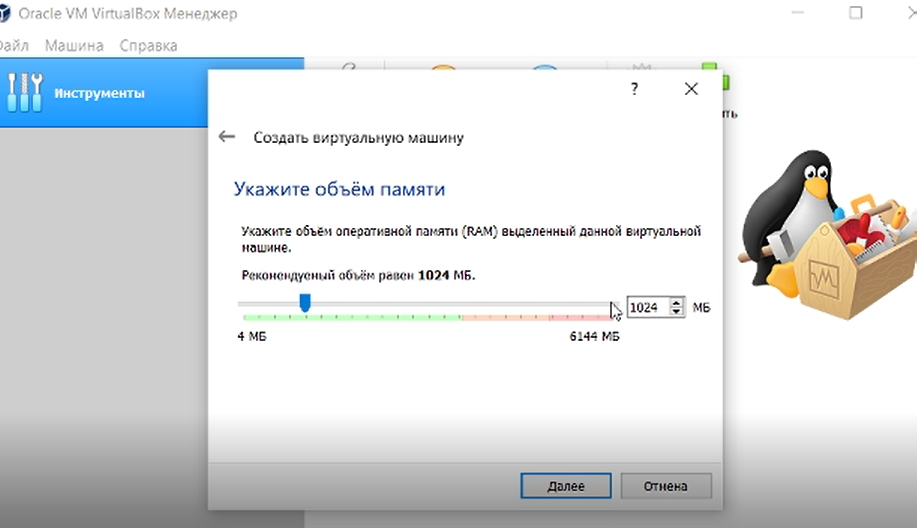
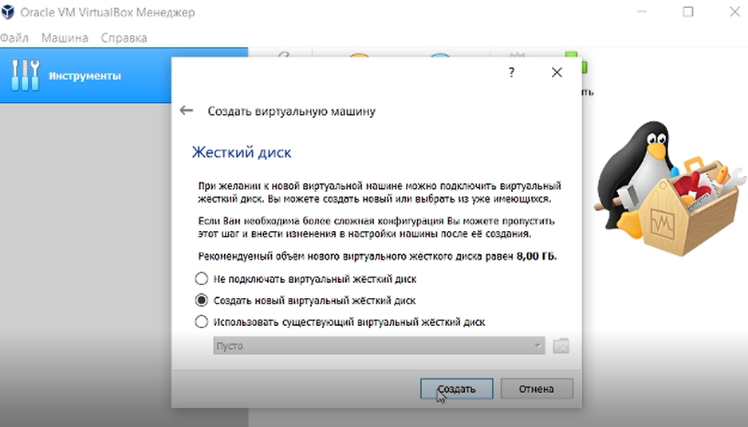
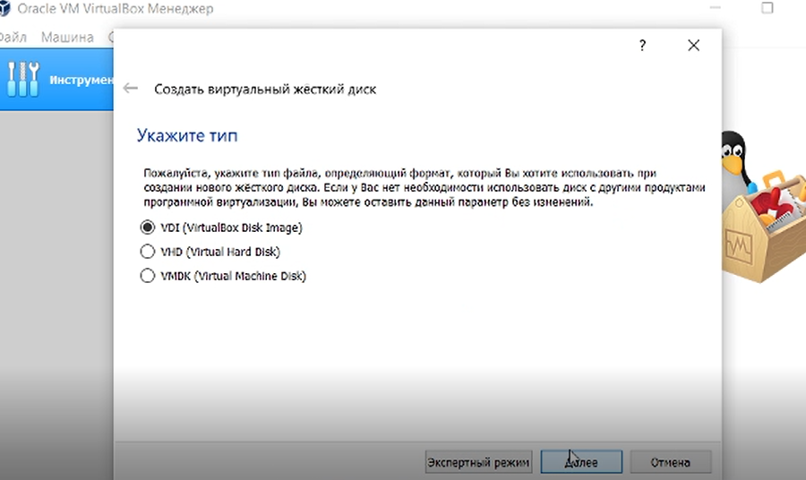
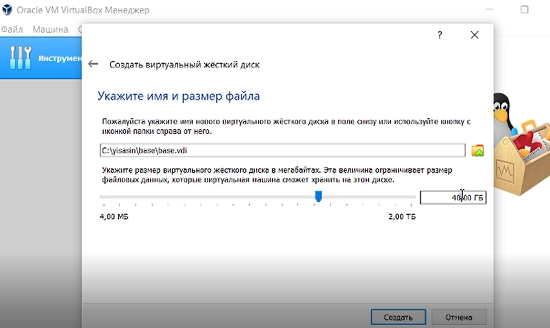
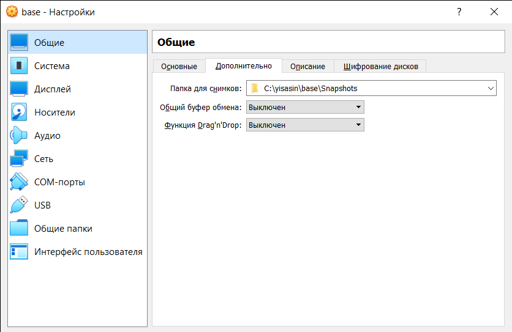
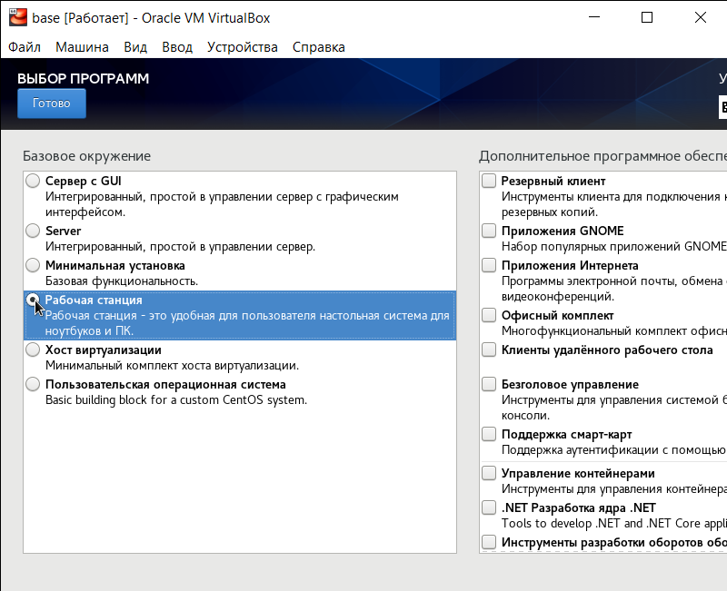
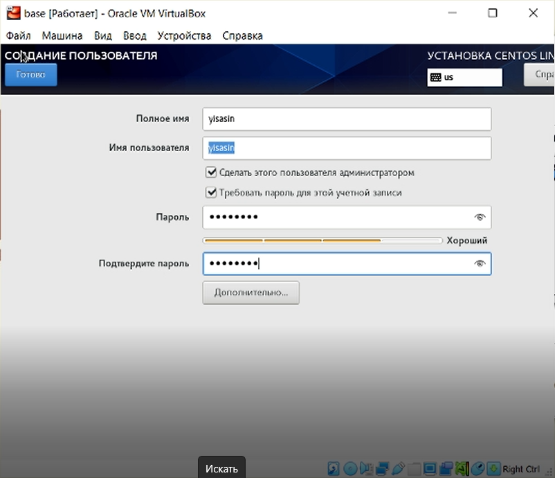
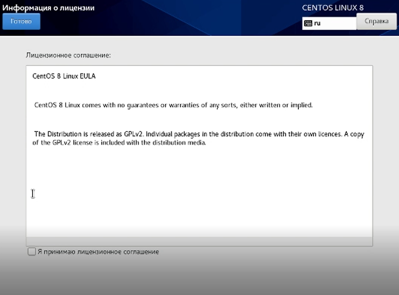
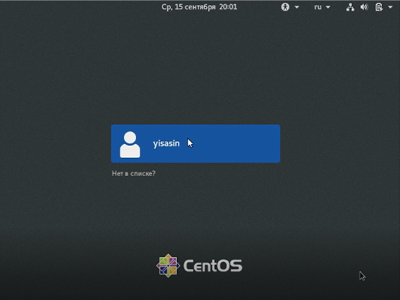
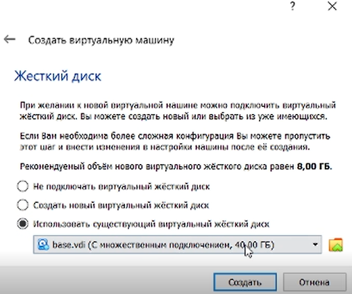

---
## Front matter
title: Лабораторная работа №1
author: [Сасин Ярослав Игоревич, НФИбд-03-18]
institute: "RUDN University, Moscow, Russian Federation"
date: 17.09.2021
lang: "ru"
## Formatting
toc: false
slide_level: 2
theme: metropolis
mainfont: PT Serif
romanfont: PT Serif
sansfont: PT Sans
monofont: Consolas
header-includes:
 - \metroset{progressbar=frametitle,sectionpage=progressbar,numbering=fraction}
 - '\makeatletter'
 - '\beamer@ignorenonframefalse'
 - '\makeatother'
aspectratio: 43
section-titles: true

---
# Цели и задачи

## Цель

Приобретение практических навыков установки операционной системы на виртуальную машину, настройки минимально необходимых для
дальнейшей работы сервисов.

## Задачи

Лабораторная работа подразумевает установку на виртуальную машину VirtualBox (https://www.virtualbox.org/) операционной системы
Linux, дистрибутив Centos.

# Выполнение

## Последовательность выполнения работы

Загрузим образ установки операционной системы, запустим VirtualBox, начнём создавать новую виртуальную машину. Зададим параметры виртуальной машины.
    

## Последовательность выполнения работы

## Последовательность выполнения работы

## Последовательность выполнения работы

## Последовательность выполнения работы

## Последовательность выполнения работы

## Последовательность выполнения работы

Выделил в окне менеджера VirtualBox виртуальную машину Base и открыл окно "свойства". Убедился, что папка для снимков виртуальной машины находится в созданном каталоге (Рис. 9).

## Последовательность выполнения работы

Выбрал в VirtualBox окно с носителями для виртуальной машины Base и добавил загруженный образ в качества нового привода оптического диска (Рис. 10).

## Последовательность выполнения работы

Запустил виртуальную машину Base, установил русский язык для интерфейса и раскладки клавиатуры и настроил параметры установки. Также создал учётную запись(Рис. 11 - 17).

## Последовательность выполнения работы

## Последовательность выполнения работы

## Последовательность выполнения работы

## Последовательность выполнения работы

## Последовательность выполнения работы

## Последовательность выполнения работы

## Последовательность выполнения работы

Завершил установку ОС (Рис. 18) и перезагрузил её.

## Последовательность выполнения работы

## Последовательность выполнения работы

Запустил виртуальную машину и настроил её (Рис. 19 - 20) дата и время были выставлены автоматически.

## Последовательность выполнения работы

## Последовательность выполнения работы

Подключился к виртуальной машине с помощью созданной учётной записи (Рис. 21)

## Последовательность выполнения работы

## Последовательность выполнения работы

Запустил терминал и вошёл в учётную запись root с помощью команды su. С помощью команды yum обновил системные файлы и установил mc (Рис. 22), после чего завершил работувиртуальной машины.

## Последовательность выполнения работы

Открыл доступ к конфигурации виртуальной машины Base для создания других машин на её базе (Рис. 23-24).

## Последовательность выполнения работы

## Последовательность выполнения работы

Далее на основе виртальной машины Base создал машину Host2, использовав файл base.vdi при конфигурации виртуального жёсткого диска (Рис. 25).

# Выводы

В ходе ЛР была успешно операционная система была успешно установлена на виртуальную 