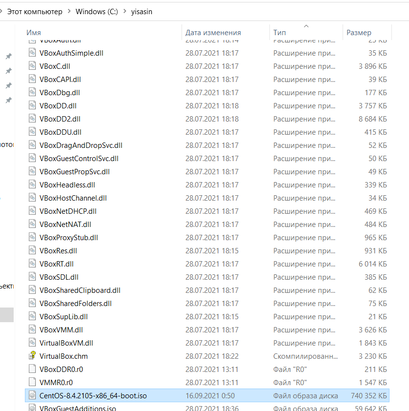
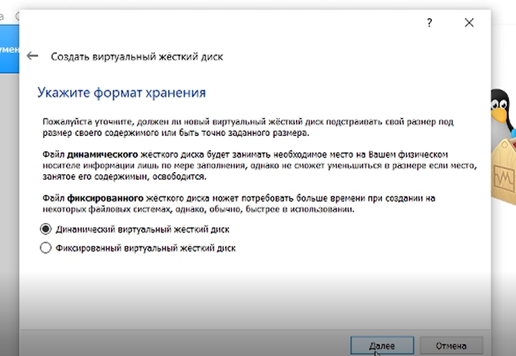

---
title: "Лабораторная работа №1. Установка и конфигурация операционной системы на виртуальную машину"
subtitle: "Информационная безопасность"
institute: "Российский Университет Дружбы Народов"
author: [Сасин Ярослав Игоревич, НФИбд-03-18]
date: "17 сентября 2021"
lang: "ru"
toc-title: "Содержание"
toc: true # Table of contents
toc_depth: 2
lof: true # List of figures
fontsize: 13pt
mainfont: PT Serif
romanfont: PT Serif
sansfont: PT Sans
monofont: Consolas
mainfontoptions: Ligatures=TeX
romanfontoptions: Ligatures=TeX
sansfontoptions: Ligatures=TeX,Scale=MatchLowercase
monofontoptions: Scale=MatchLowercase
titlepage: true
titlepage-text-color: "000000"
titlepage-rule-color: "1A1B35"
titlepage-rule-height: 2
listings-no-page-break: true
indent: true
header-includes:
  - \usepackage{sectsty}
  - \sectionfont{\clearpage}
  - \linepenalty=10 # the penalty added to the badness of each line within a paragraph (no associated penalty node) Increasing the value makes tex try to have fewer lines in the paragraph.
  - \interlinepenalty=0 # value of the penalty (node) added after each line of a paragraph.
  - \hyphenpenalty=50 # the penalty for line breaking at an automatically inserted hyphen
  - \exhyphenpenalty=50 # the penalty for line breaking at an explicit hyphen
  - \binoppenalty=700 # the penalty for breaking a line at a binary operator
  - \relpenalty=500 # the penalty for breaking a line at a relation
  - \clubpenalty=150 # extra penalty for breaking after first line of a paragraph
  - \widowpenalty=150 # extra penalty for breaking before last line of a paragraph
  - \displaywidowpenalty=50 # extra penalty for breaking before last line before a display math
  - \brokenpenalty=100 # extra penalty for page breaking after a hyphenated line
  - \predisplaypenalty=10000 # penalty for breaking before a display
  - \postdisplaypenalty=0 # penalty for breaking after a display
  - \floatingpenalty = 20000 # penalty for splitting an insertion (can only be split footnote in standard LaTeX)
  - \raggedbottom # or \flushbottom
  - \usepackage{float} # keep figures where there are in the text
  - \floatplacement{figure}{H} # keep figures where there are in the text
...

# Цели и задачи

**Цель:** Приобретение практических навыков установки операционной системы на виртуальную машину, настройки минимально необходимых для дальнейшей работы сервисов.

# Ход выполнения лабораторной работы

## Последовательность выполнения работы

Установил VirtualBox на домашний ПК с помощью стандартного установщика. Создал папку с именем пользователя и перенёс туда образ диска с установщиком системы CentOs (Рис. 1).

Запустил виртуальную машину. Убедился, что виртуальные машины расположены в созданном каталоге (Рис. 2).

Создал новую виртуальную машину. Задал параметры, предложенные в тексте лабораторной работы (Рис. 3 - 8).

Выделил в окне менеджера VirtualBox виртуальную машину Base и открыл окно "свойства". Убедился, что папка для снимков виртуальной машины находится в созданном каталоге (Рис. 9).

Выбрал в VirtualBox окно с носителями для виртуальной машины Base и добавил загруженный образ в качества нового привода оптического диска (Рис. 10).

Запустил виртуальную машину Base, установил русский язык для интерфейса и раскладки клавиатуры и настроил параметры установки. Также создал учётную запись(Рис. 11 - 17).

Завершил установку ОС (Рис. 18) и перезагрузил её.

Запустил виртуальную машину и настроил её (Рис. 19 - 20) дата и время были выставлены автоматически.

Подключился к виртуальной машине с помощью созданной учётной записи (Рис. 21)

Запустил терминал и вошёл в учётную запись root с помощью команды su. С помощью команды yum обновил системные файлы и установил mc (Рис. 22), после чего завершил работувиртуальной машины.

Открыл доступ к конфигурации виртуальной машины Base для создания других машин на её базе (Рис. 23-24).

Далее на основе виртальной машины Base создал машину Host2, использовав файл base.vdi при конфигурации виртуального жёсткого диска (Рис. 25).

# Выводы

В ходе ЛР была успешно операционная система была успешно установлена на виртуальную машину и конфигурирована.