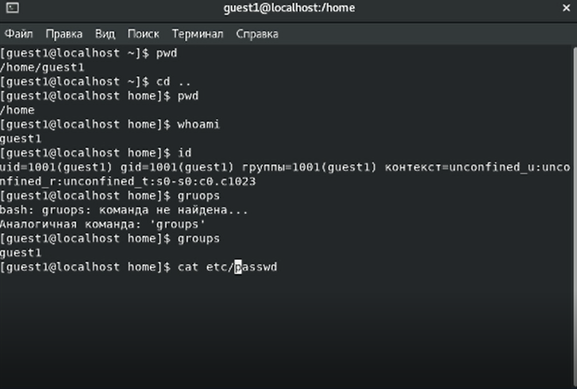
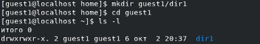

---
title: "Лабораторная работа №2. Дискреционное разграничение прав в Linux. Основные атрибуты"
subtitle: "Информационная безопасность"
institute: "Российский Университет Дружбы Народов"
author: [Сасин Ярослав Игоревич, НФИбд-03-18]
date: "2 октября 2021"
lang: "ru"
toc-title: "Содержание"
toc: true # Table of contents
toc_depth: 2
lof: true # List of figures
fontsize: 13pt
mainfont: PT Serif
romanfont: PT Serif
sansfont: PT Sans
monofont: Consolas
mainfontoptions: Ligatures=TeX
romanfontoptions: Ligatures=TeX
sansfontoptions: Ligatures=TeX,Scale=MatchLowercase
monofontoptions: Scale=MatchLowercase
titlepage: true
titlepage-text-color: "000000"
titlepage-rule-color: "1A1B35"
titlepage-rule-height: 2
listings-no-page-break: true
indent: true
header-includes:
  - \usepackage{sectsty}
  - \sectionfont{\clearpage}
  - \linepenalty=10 # the penalty added to the badness of each line within a paragraph (no associated penalty node) Increasing the value makes tex try to have fewer lines in the paragraph.
  - \interlinepenalty=0 # value of the penalty (node) added after each line of a paragraph.
  - \hyphenpenalty=50 # the penalty for line breaking at an automatically inserted hyphen
  - \exhyphenpenalty=50 # the penalty for line breaking at an explicit hyphen
  - \binoppenalty=700 # the penalty for breaking a line at a binary operator
  - \relpenalty=500 # the penalty for breaking a line at a relation
  - \clubpenalty=150 # extra penalty for breaking after first line of a paragraph
  - \widowpenalty=150 # extra penalty for breaking before last line of a paragraph
  - \displaywidowpenalty=50 # extra penalty for breaking before last line before a display math
  - \brokenpenalty=100 # extra penalty for page breaking after a hyphenated line
  - \predisplaypenalty=10000 # penalty for breaking before a display
  - \postdisplaypenalty=0 # penalty for breaking after a display
  - \floatingpenalty = 20000 # penalty for splitting an insertion (can only be split footnote in standard LaTeX)
  - \raggedbottom # or \flushbottom
  - \usepackage{float} # keep figures where there are in the text
  - \floatplacement{figure}{H} # keep figures where there are in the text
...- 

# Цель работы

Получение практических навыков работы в консоли с атрибутами файлов, закрепление теоретических основ дискреционного разграничения доступа в современных системах с открытым кодом на базе ОС Linux.

# Выполнение лабораторной работы

Используя учетную запись root, создал пользователя guest1 и установил для него пароль: (рис. -@fig:001):

{ #fig:001 }

Зашел в систему с новым пользователем, определил директорию, в которой нахожусь, командой pwd. Перешел в домашнюю директорию.

Уточнил имя пользователя командой whoami, далее, используя команду id, узнал uid (1001) и gid (1001). Ввел команду groups, получил группу guest1, что совпадает с выводом команды id.

Имя пользователя, выведенное командой id, совпадает с приглашением командной строки.

Далее посмотрел файл etc/passwd с помощью команды cat (рис. 2) (рис. -@fig:002)

{ #fig:002 }

Вывел строку с информацией о пользователе с помощью фильтра grep guest1: (рис. -@fig:003)

{ #fig:003 }

Как видим, в файле указаны верные uid и gid (оба 1002).

Определил содержание директории home командой ls, получил список поддиректорий, на каждой из них установлены права на чтение, запись и выполнение только для владельцев.

Создал папку guest1/dir1, с помощью команд ls -l и lsattr посмотрел, какие права доступа и расширенные атрибуты у новой папки. Для нее права доступа полные, кроме записи для "прочих пользователей" и никаких расширенных атрибутов. (рис. -@fig:004)

{ #fig:004 }

Далее с помощью команды chmod обнулил атрибуты директории dir1 и попытался создать в ней файл file1 с содержимым "test". Из-за отсутсвия прав был получен отказ в доступе.
После этого я проверил результат выполнения предыдущей операции командой ls, но также получил отказ в доступе. В итоге я открыл файловый менеджер и убедился, что файл не создан. (вышеперечисленные действия на рис. 5) (рис. -@fig:005)

{ #fig:005 }

Затем, я создал в папке dir1 файл test и от имени владельца опытным путем начал проверять, какие операции разрешены при разных уровнях доступа к директории и файлу.(рис. -@fig:006)

{ #fig:006 }

На основе полученных ответов заполнил таблицу (таб. 2.1)

|Права директории|Права файла|Создание файла|Удаление файла|Запись в файл|Чтение файла|Смена директории|Просмотр файлов в директории|Переименование файла|Смена атрибутов файла|
|----------------|-----------|--------------|--------------|-------------|------------|----------------|----------------------------|--------------------|---------------------|
|d(000)          |(000)      |-             |-             |-            |-           |-               |-                           |-                   |-                    |
|d(000)          |(100)      |-             |-             |-            |-           |-               |-                           |-                   |-                    |
|d(000)          |(200)      |-             |-             |-            |-           |-               |-                           |-                   |-                    |
|d(000)          |(300)      |-             |-             |-            |-           |-               |-                           |-                   |-                    |
|d(000)          |(400)      |-             |-             |-            |-           |-               |-                           |-                   |-                    |
|d(000)          |(500)      |-             |-             |-            |-           |-               |-                           |-                   |-                    |
|d(000)          |(600)      |-             |-             |-            |-           |-               |-                           |-                   |-                    |
|d(000)          |(700)      |-             |-             |-            |-           |-               |-                           |-                   |-                    |
|d(100)          |(000)      |-             |-             |-            |-           |+               |-                           |-                   |+                    |
|d(100)          |(100)      |-             |-             |-            |-           |+               |-                           |-                   |+                    |
|d(100)          |(200)      |-             |-             |+            |-           |+               |-                           |-                   |+                    |
|d(100)          |(300)      |-             |-             |+            |-           |+               |-                           |-                   |+                    |
|d(100)          |(400)      |-             |-             |-            |+           |+               |-                           |-                   |+                    |
|d(100)          |(500)      |-             |-             |-            |+           |+               |-                           |-                   |+                    |
|d(100)          |(600)      |-             |-             |+            |+           |+               |-                           |-                   |+                    |
|d(100)          |(700)      |-             |-             |+            |+           |+               |-                           |-                   |+                    |
|d(200)          |(000)      |-             |-             |-            |-           |-               |-                           |-                   |-                    |
|d(200)          |(100)      |-             |-             |-            |-           |-               |-                           |-                   |-                    |
|d(200)          |(200)      |-             |-             |-            |-           |-               |-                           |-                   |-                    |
|d(200)          |(300)      |-             |-             |-            |-           |-               |-                           |-                   |-                    |
|d(200)          |(400)      |-             |-             |-            |-           |-               |-                           |-                   |-                    |
|d(200)          |(500)      |-             |-             |-            |-           |-               |-                           |-                   |-                    |
|d(200)          |(600)      |-             |-             |-            |-           |-               |-                           |-                   |-                    |
|d(200)          |(700)      |-             |-             |-            |-           |-               |-                           |-                   |-                    |
|d(300)          |(000)      |+             |+             |-            |-           |+               |-                           |+                   |+                    |
|d(300)          |(100)      |+             |+             |-            |-           |+               |-                           |+                   |+                    |
|d(300)          |(200)      |+             |+             |+            |-           |+               |-                           |+                   |+                    |
|d(300)          |(300)      |+             |+             |+            |-           |+               |-                           |+                   |+                    |
|d(300)          |(400)      |+             |+             |-            |+           |+               |-                           |+                   |+                    |
|d(300)          |(500)      |+             |+             |-            |+           |+               |-                           |+                   |+                    |
|d(300)          |(600)      |+             |+             |+            |+           |+               |-                           |+                   |+                    |
|d(300)          |(700)      |+             |+             |+            |+           |+               |-                           |+                   |+                    |
|d(400)          |(000)      |-             |-             |-            |-           |-               |+                           |-                   |-                    |
|d(400)          |(100)      |-             |-             |-            |-           |-               |+                           |-                   |-                    |
|d(400)          |(200)      |-             |-             |-            |-           |-               |+                           |-                   |-                    |
|d(400)          |(300)      |-             |-             |-            |-           |-               |+                           |-                   |-                    |
|d(400)          |(400)      |-             |-             |-            |-           |-               |+                           |-                   |-                    |
|d(400)          |(500)      |-             |-             |-            |-           |-               |+                           |-                   |-                    |
|d(400)          |(600)      |-             |-             |-            |-           |-               |+                           |-                   |-                    |
|d(400)          |(700)      |-             |-             |-            |-           |-               |+                           |-                   |-                    |
|d(500)          |(000)      |-             |-             |-            |-           |+               |+                           |-                   |+                    |
|d(500)          |(100)      |-             |-             |-            |-           |+               |+                           |-                   |+                    |
|d(500)          |(200)      |-             |-             |+            |-           |+               |+                           |-                   |+                    |
|d(500)          |(300)      |-             |-             |+            |-           |+               |+                           |-                   |+                    |
|d(500)          |(400)      |-             |-             |-            |+           |+               |+                           |-                   |+                    |
|d(500)          |(500)      |-             |-             |-            |+           |+               |+                           |-                   |+                    |
|d(500)          |(600)      |-             |-             |+            |+           |+               |+                           |-                   |+                    |
|d(500)          |(700)      |-             |-             |+            |+           |+               |+                           |-                   |+                    |
|d(600)          |(000)      |-             |-             |-            |-           |-               |+                           |-                   |-                    |
|d(600)          |(100)      |-             |-             |-            |-           |-               |+                           |-                   |-                    |
|d(600)          |(200)      |-             |-             |-            |-           |-               |+                           |-                   |-                    |
|d(600)          |(300)      |-             |-             |-            |-           |-               |+                           |-                   |-                    |
|d(600)          |(400)      |-             |-             |-            |-           |-               |+                           |-                   |-                    |
|d(600)          |(500)      |-             |-             |-            |-           |-               |+                           |-                   |-                    |
|d(600)          |(600)      |-             |-             |-            |-           |-               |+                           |-                   |-                    |
|d(600)          |(700)      |-             |-             |-            |-           |-               |+                           |-                   |-                    |
|d(700)          |(000)      |+             |+             |-            |-           |+               |+                           |+                   |+                    |
|d(700)          |(100)      |+             |+             |-            |-           |+               |+                           |+                   |+                    |
|d(700)          |(200)      |+             |+             |+            |-           |+               |+                           |+                   |+                    |
|d(700)          |(300)      |+             |+             |+            |-           |+               |+                           |+                   |+                    |
|d(700)          |(400)      |+             |+             |-            |+           |+               |+                           |+                   |+                    |
|d(700)          |(500)      |+             |+             |-            |+           |+               |+                           |+                   |+                    |
|d(700)          |(600)      |+             |+             |+            |+           |+               |+                           |+                   |+                    |
|d(700)          |(700)      |+             |+             |+            |+           |+               |+                           |+                   |+                    |

: Установленные права и разрешённые действия

Затем, на основе полученных ответов заполнил таблицу 2.2. Также для заполнения этой таблицы проверил минимальные разрешения для создания/удаления субдиректории: (рис. -@fig:007):

{ #fig:007 }

В итоге получил следующую таблицу: (таб. 2.2)

|Операция              |min права на директорию|min права на файл|
|----------------------|-----------------------|-----------------|
|Создание файла        |d(300)                 |(000)            |
|Удаление файла        |d(300)                 |(000)            |
|Чтение файла          |d(100)                 |(400)            |
|Запись в файл         |d(100)                 |(200)            |
|Переименование файла  |d(300)                 |(000)            |
|Создание поддиректории|d(300)                 |(000)            |
|Удаление поддиректории|d(300)                 |(000)            |

: Минимальные права для совершения операций

# Выводы

Получил практические навыки работы в консоли с атрибутами файлов, закрепил теоретические основы дискреционного разграничения доступа в современных системах с открытым кодом на базе ОС Linux.
