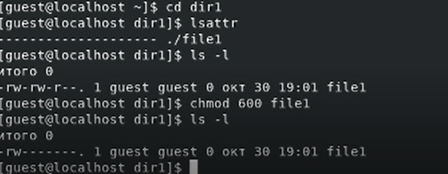
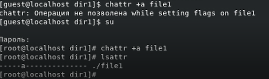
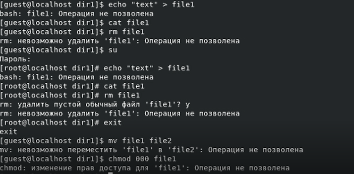
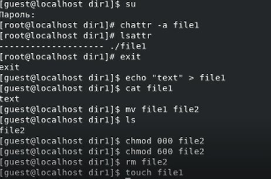
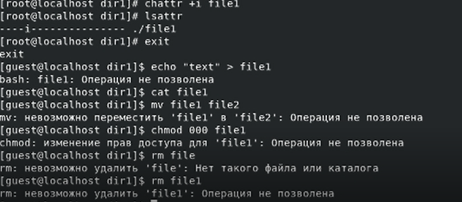

---
## Front matter
title: Лабораторная работа № 4. Дискреционное разграничение прав в Linux. Расширенные атрибуты
author: [Сасин Ярослав Игоревич, НФИбд-03-18]
institute: "RUDN University, Moscow, Russian Federation"
date: 30.10.2021
lang: "ru"
## Formatting
toc: false
slide_level: 2
theme: metropolis
mainfont: PT Serif
romanfont: PT Serif
sansfont: PT Sans
monofont: PT Mono
mainfontoptions: Ligatures=TeX
romanfontoptions: Ligatures=TeX
sansfontoptions: Ligatures=TeX,Scale=MatchLowercase
monofontoptions: Scale=MatchLowercase
header-includes:
 - \metroset{progressbar=frametitle,sectionpage=progressbar,numbering=fraction}
 - '\makeatletter'
 - '\beamer@ignorenonframefalse'
 - '\makeatother'
aspectratio: 43
section-titles: true

---
# Цели и задачи

## Цель

Получение практических навыков работы в консоли с расширенными атрибутами файлов

# Выполнение

## Процесс выполнения

От имени пользователя guest определили расширенные атрибуты файла /home/guest/dir1/file1 командой
lsattr /home/guest/dir1/file1, изменили права на файл file1 командой chmod 600 file1

{ #fig:001 width=70% }

## Процесс выполнения

Попробовали установить на файл /home/guest/dir1/file1 расширенный атрибут a от имени пользователя guest:
chattr +a /home/guest/dir1/file1. В ответ получили отказ от выполнения операции, повторили от имени суперпользователя, проверили правильность установления атрибута

{ #fig:002 width=70% }

## Процесс выполнения

Пробуем записать данные и прочитать их в file1, удалить файл, получаем отказ. Остальные операции также невозможно выполнить.

{ #fig:003 width=70% }

## Процесс выполнения

Снимаем атрибут a, пробуем записать и прочитать файл, выполняется успешно

{ #fig:004 width=70% }

## Процесс выполнения

Добавляем атрибут i, проводим те же операции. За исключением чтения, в остальных операциях было отказано.

{ #fig:005 width=70% }

# Выводы

В результате выполнения работы я повысил свои навыки использования интерфейса командой строки (CLI), познакомился на примерах с тем, как используются основные и расширенные атрибуты при разграничении доступа. Имел возможность связать теорию дискреционного разделения доступа с её реализацией на практике в ОС Linux. Опробовал действие на практике раёсширенных атрибутов «а» и «i».
