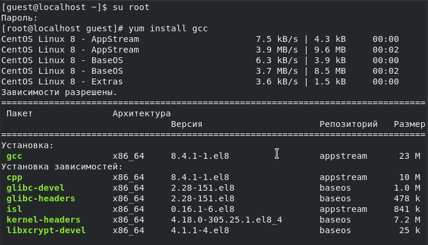
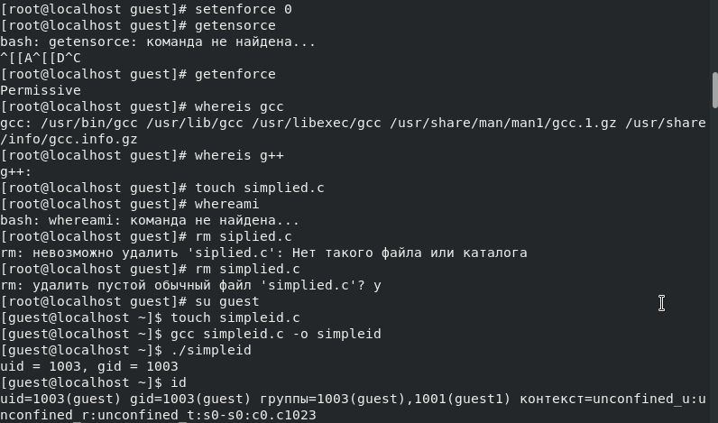
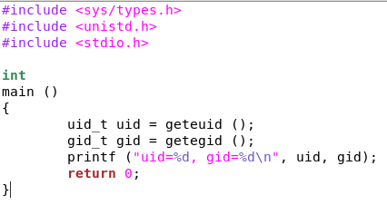
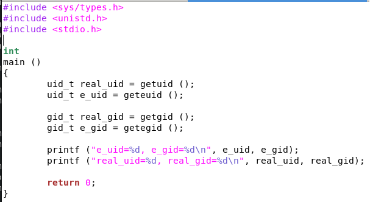
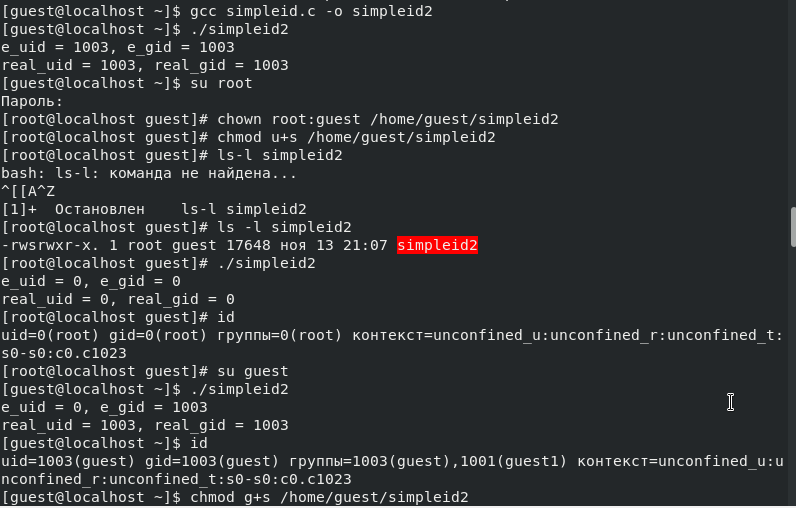
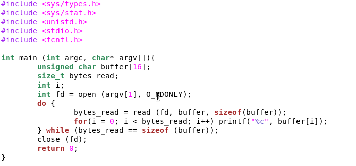
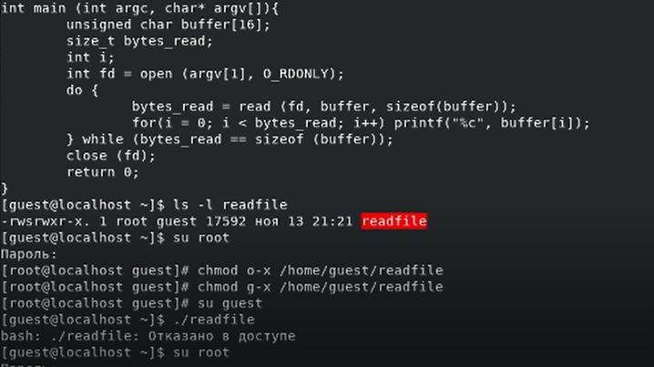
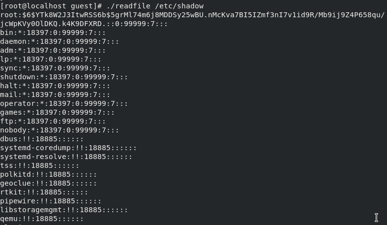
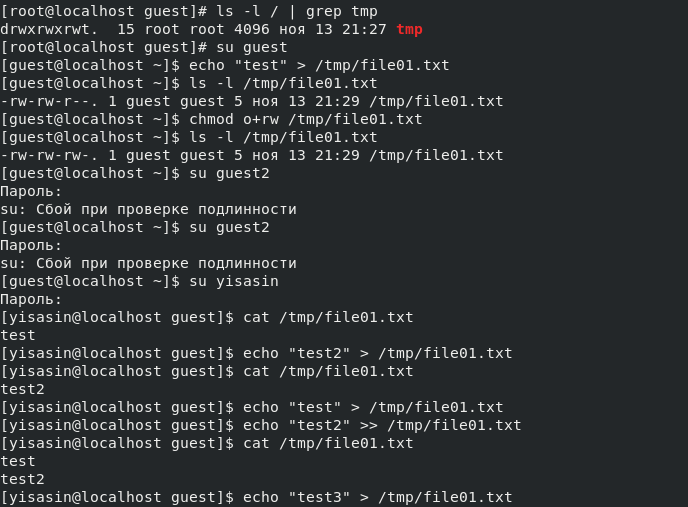

---
## Front matter
title: Лабораторная работа № 5. Исследование влияния дополнительных атрибутов
author: [Сасин Ярослав Игоревич, НФИбд-03-18]
institute: "RUDN University, Moscow, Russian Federation"
date: 13.11.2021
lang: "ru"
## Formatting
toc: false
slide_level: 2
theme: metropolis
mainfont: PT Serif
romanfont: PT Serif
sansfont: PT Sans
monofont: PT Mono
mainfontoptions: Ligatures=TeX
romanfontoptions: Ligatures=TeX
sansfontoptions: Ligatures=TeX,Scale=MatchLowercase
monofontoptions: Scale=MatchLowercase
header-includes:
 - \metroset{progressbar=frametitle,sectionpage=progressbar,numbering=fraction}
 - '\makeatletter'
 - '\beamer@ignorenonframefalse'
 - '\makeatother'
aspectratio: 43
section-titles: true

---

# Цель работы

Изучение механизмов изменения идентификаторов, применения SetUID- и Sticky-битов. Получение практических навыков работы в консоли с дополнительными атрибутами.
Рассмотрение работы механизма смены идентификатора процессов пользователей, а также влияние бита Sticky на запись и удаление файлов.

# Выполнение лабораторной работы

{ #fig:001 }

# Выполнение лабораторной работы

{ #fig:002 }

# Выполнение лабораторной работы

{ #fig:003 }

# Выполнение лабораторной работы

{ #fig:004 }

# Выполнение лабораторной работы

{ #fig:005 }

# Выполнение лабораторной работы

{ #fig:007 }

# Выполнение лабораторной работы

{ #fig:008 }

# Выполнение лабораторной работы

{ #fig:009 }

# Выполнение лабораторной работы

{ #fig:010 }

# Выводы

Изучил механизмы изменения идентификаторов, применения SetUID- и Sticky-битов. Получил практические навыки работы в консоли с дополнительными атрибутами.
Рассмотрел работу механизма смены идентификатора процессов пользователей, а также влияние бита Sticky на запись и удаление файлов.