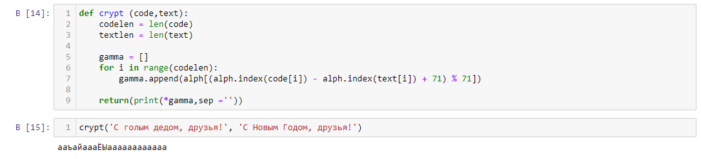

---
## Front matter
lang: ru-RU
title: Элементы криптографии. Однократное гаммирование
author: Сасин Ярослав НФИбд-03-18
institute:
	inst{1}RUDN University, Moscow, Russian Federation
date: 2021, 4 december
## Formatting
toc: false
slide_level: 2
theme: metropolis
mainfont: PT Serif
romanfont: PT Serif
sansfont: PT Sans
monofont: PT Mono
mainfontoptions: Ligatures=TeX
romanfontoptions: Ligatures=TeX
sansfontoptions: Ligatures=TeX,Scale=MatchLowercase
monofontoptions: Scale=MatchLowercase
header-includes:
 - \metroset{progressbar=frametitle,sectionpage=progressbar,numbering=fraction}
 - '\makeatletter'
 - '\beamer@ignorenonframefalse'
 - '\makeatother'
aspectratio: 43
section-titles: true
---
# Цель работы

Освоить на практике применение режима однократного гаммирования.

# Выполнение лабораторной работы

## 1)
Нужно подобрать ключ, чтобы получить сообщение «С Новым Годом,
друзья!». Требуется разработать приложение, позволяющее шифровать и
дешифровать данные в режиме однократного гаммирования. Приложение
должно:
1. Определить вид шифротекста при известном ключе и известном открытом тексте.
2. Определить ключ, с помощью которого шифротекст может быть преобразован в некоторый
фрагмент текста, представляющий собой один из возможных вариантов прочтения открытого текста.

## 2)
Функция шифрования
(рис. -@fig:001)

{ #fig:001 width=70% }

## 3)
Функция расшифрования
(рис. -@fig:002)

{ #fig:002 width=70% }

## 4)
Функция, которая определяет ключ, с помощью которого шифротекст может быть преобразован в некоторый
фрагмент текста, представляющий собой один из возможных вариантов прочтения открытого текста. (рис. -@fig:003)

{ #fig:003 width=70% }

# Выводы

В результате выполнения работы я освоил на практике применение режима однократного гаммирования.
