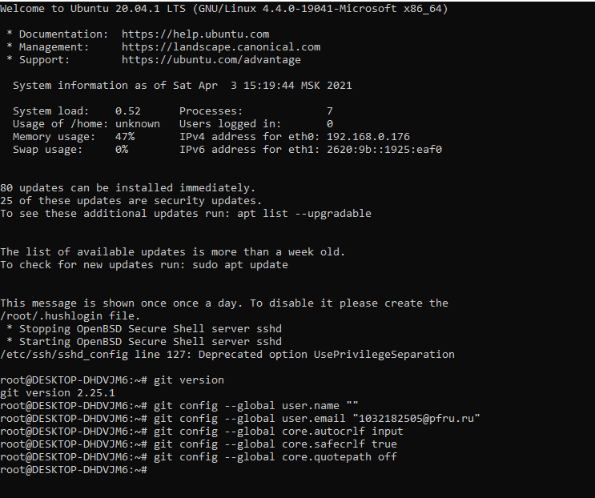

---
## Front matter
lang: ru-RU
title: "Отчет по лабораторной работе №1: Система контроля версий Git"
subtitle: "*дисциплина: Математическое моделирование*"
author: "Сасин Ярослав Игоревич, НФИбд-03-18"

## Formatting
toc: false
slide_level: 2
theme: metropolis
header-includes: 
 - \metroset{progressbar=frametitle,sectionpage=progressbar,numbering=fraction}
 - '\makeatletter'
 - '\beamer@ignorenonframefalse'
 - '\makeatother'
aspectratio: 43
section-titles: true

---

# Введение

## Цель и задачи работы

**Цель:** 

ознакомление с системой контроля версий Git. 

**Задачи:**

1. ознакомление с системой контроля версий Git;

2. создание каталогов для хранения данных последующих лабораторнвх работ с их выгрузкой на Github;

3. ознакомление с набором расширений git-flow.

# Терминология. Условные обозначения

**git** - это бесплатная распределенная система контроля версий с открытым исходным кодом, предназначенная для быстрого и эффективного управления всеми проектами любого размера.

[**GitHub**](https://github.com) - крупнейший веб-сервис для хостинга IT-проектов и их совместной разработки. Веб-сервис основан на системе контроля версий Git и разработан на Ruby on Rails и Erlang компанией GitHub, Inc. 

# Терминология. Условные обозначения

**git-flow** — это набор расширений git предоставляющий высокоуровневые операции над репозиторием для поддержки модели ветвления Vincent Driessen.

[**Homebrew**](https://brew.sh) — утилита командной строки в macOS и Linux, которая позволяет устанавливать пакеты и приложения (менеджер пакетов). Распространяется как свободное программное обеспечение с открытым кодом. 

# Выполение лабораторной работы

## Установка git

- Установка git при помощи менеждера пакетов Homebrew.

- Установка имени и электронной почты.

- Установка окончаний строк.

- Установка отображения unicode. 

## Установка git

## Привязка git-репозитория к репозиторию на GitHub

- Генерация SSH-ключа и его добавление на GitHub.

- Добавление директории для файлов работ.

- Создание простого файла для более наглядного отображения на GitHub.

- Инициализация git и привязка репозитория на GitHub.

## Привязка git-репозитория к репозиторию на GitHub

## Работа с git-flow

- Установка git-flow при помощи менеждера пакетов Homebrew.

- Написание отчета и создание презентации на ветке feature. 

- Создание ветки release.

- Конечный переход к векте master.

# Выводы

В ходе выполнения лабораторной работы были изучены основные особенности системы контроля версий git, а также специфика выполнения и оформления лабораторных работ для данной дисциплины. 
