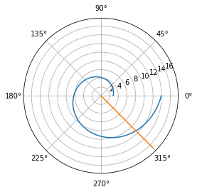
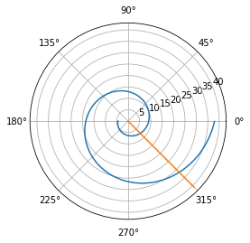

---
## Front matter
lang: ru-RU
title: "Отчет по лабораторной работе №2: Задача о погоне"
subtitle: "*дисциплина: Математическое моделирование*"
author: "Сасин Ярослав Игоревич, НФИбд-03-18"

## Formatting
toc: false
slide_level: 2
theme: metropolis
header-includes:
 - \metroset{progressbar=frametitle,sectionpage=progressbar,numbering=fraction}
 - '\makeatletter'
 - '\beamer@ignorenonframefalse'
 - '\makeatother'
aspectratio: 43
section-titles: true

---

# Введение

Основной **целью лабораторной работы** можно считать Ппостроение математической модели для выбора правильной стратегии при решении задачи о погоне.


Можно выделить три основные **задачи данной лабораторной работы**:  
1. Провести рассуждения и вывод дифференциальных уравнений, если скорость катера больше скорости лодки в 4.5 раз;  
2. Построить траекторию движения катера и лодки для двух случаев;  
3. Определить по графику точку пересечения катера и лодки.


# Формулировка задания

**Вариант 26**

На море в тумане катер береговой охраны преследует лодку браконьеров.
Через определенный промежуток времени туман рассеивается, и лодка
обнаруживается на расстоянии 15,5 км от катера. Затем лодка снова скрывается в
тумане и уходит прямолинейно в неизвестном направлении. Известно, что скорость
катера в 4,5 раза больше скорости браконьерской лодки.
1. Запишите уравнение, описывающее движение катера, с начальными
условиями для двух случаев (в зависимости от расположения катера
относительно лодки в начальный момент времени).
2. Постройте траекторию движения катера и лодки для двух случаев.
3. Найдите точку пересечения траектории катера и лодки 

## Теоритическая часть

- $t_0 = 0$  
- $x_{l0} = 0$ - место нахождения браконьеров в момент обнаружения  
- $x_{k0} = 15,5$ - место нахождения катера береговой охраны относительно лодки браконьеров в момент обнаружения лодки 

- $x_1 = \frac{15,5}{3,5}$  
- $x_2 = \frac{15,5}{5,5}$  
- $v_{\tau} = \sqrt{20,25v^2 - v^2} = \sqrt{19,25}v$ 

## Теоритическая часть

Решение исходной задачи сводится к решению дифференциального уравнения $\frac{dr}{d\theta} = \frac{r}{\sqrt{19.25}}$ с начальными условиями  
$$
\begin{cases}
  \theta_{0} = 0 
  \\
  r_{0} = \frac{15,5}{5,5}
\end{cases}
$$  
или  
$$
\begin{cases}
  \theta_{0} = -\pi 
  \\
  r_{0} = \frac{15,5}{3,5}
\end{cases}
$$

# Реализация модели

## Подключение библиотек

```py
import numpy as np
from math import sqrt, pi, tan
from scipy.integrate import odeint
import matplotlib.pyplot as plt
```

## Функции, описывающие движениие лодки и катера

Для катера береговой охраны:

```py 
def dx(r, theta):
    dr = r / sqrt(19.25)
    return dr
```

Для лодки браконьеров:

```py 
def dxdx(t):
    xt = tan(fi) * t
    return xt
```

## Функция перехода из декартовых координаи в полярные

```py
def cart2pol(x, y):
    rho = np.sqrt(x**2 + y**2)
    phi = np.arctan2(y, x)
    return(rho, phi)
```

## Начальные значения

```py 
s = 15.5 # Начальное расстояние от лодки до катера
fi = 3 * pi / 4 
```
## Начальные значения

```py
# Для случая 1
# Для катера береговой охраны
r0 = 15.5 / 5.5
theta0  = 0
theta = np.arange(theta0, 2 * pi, 0.01)
# Для лодки браконьеров
t0 = 0
t = np.arange(t0, 13, 1)
```

## Начальные значения

```py
# Для случая 2
# Для катера береговой охраны
r0 = 15.5 / 3.5
theta0  = - pi
theta = np.arange(theta0, 2 * pi, 0.01)
# Для лодки браконьеров
t0 = 0
t = np.arange(t0, 60, 1)
```

## Нахождение промежуточных координат и построение графиков

```py
r = odeint(dx, r0, theta)

[rho, phi] = cart2pol(t, dxdx(t))

plt.polar(theta, r)
plt.polar(phi, rho)
```

# Построенные графики

## Первый случай

{ #fig:001 width=70% }

## Второй случай

{ #fig:002 width=70% }

# Выводы

В ходе выполнения лабораторной работы была изучена модель задачи о погоне, а также способ ее решения. 
