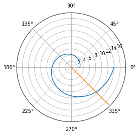
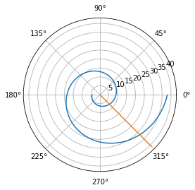

---
# Front matter
lang: ru-RU
title: "Отчет по лабораторной работе №2: Задача о погоне"
subtitle: "*дисциплина: Математическое моделирование*"
author: "Сасин Ярослав Игоревич, НФИбд-03-18"


# Formatting
toc-title: "Содержание"
toc: true # Table of contents
toc_depth: 2
lof: true # List of figures
lot: true # List of tables
fontsize: 12pt
linestretch: 1.5
papersize: a4paper
documentclass: scrreprt
polyglossia-lang: russian
polyglossia-otherlangs: english
mainfont: PT Serif
romanfont: PT Serif
sansfont: PT Sans
monofont: PT Mono
mainfontoptions: Ligatures=TeX
romanfontoptions: Ligatures=TeX
sansfontoptions: Ligatures=TeX,Scale=MatchLowercase
monofontoptions: Scale=MatchLowercase
indent: true
pdf-engine: lualatex
header-includes:
  - \linepenalty=10 # the penalty added to the badness of each line within a paragraph (no associated penalty node) Increasing the value makes tex try to have fewer lines in the paragraph.
  - \interlinepenalty=0 # value of the penalty (node) added after each line of a paragraph.
  - \hyphenpenalty=50 # the penalty for line breaking at an automatically inserted hyphen
  - \exhyphenpenalty=50 # the penalty for line breaking at an explicit hyphen
  - \binoppenalty=700 # the penalty for breaking a line at a binary operator
  - \relpenalty=500 # the penalty for breaking a line at a relation
  - \clubpenalty=150 # extra penalty for breaking after first line of a paragraph
  - \widowpenalty=150 # extra penalty for breaking before last line of a paragraph
  - \displaywidowpenalty=50 # extra penalty for breaking before last line before a display math
  - \brokenpenalty=100 # extra penalty for page breaking after a hyphenated line
  - \predisplaypenalty=10000 # penalty for breaking before a display
  - \postdisplaypenalty=0 # penalty for breaking after a display
  - \floatingpenalty = 20000 # penalty for splitting an insertion (can only be split footnote in standard LaTeX)
  - \raggedbottom # or \flushbottom
  - \usepackage{float} # keep figures where there are in the text
  - \floatplacement{figure}{H} # keep figures where there are in the text
---

# Введение

## Цель работы

Основной целью лабораторной работы можно считать Ппостроение математической модели для выбора правильной стратегии при решении задачи о погоне.

## Задачи

Можно выделить три основные задачи данной лабораторной работы:  
1. Провести рассуждения и вывод дифференциальных уравнений, если скорость катера больше скорости лодки в 4.5 раза;  
2. Построить траекторию движения катера и лодки для двух случаев;  
3. Определить по графику точку пересечения катера и лодки.

## Объект и предмет исследования

Объектом исследования в данной лабораторной работе является задача о погоне, а предметом исследования - траектории движения лодки браконьеров и катера берешлвлй охраны при заданных начальных условиях.

# Теоретические сведения: Задача о погоне

## Формулировка задания


**Вариант 26**

На море в тумане катер береговой охраны преследует лодку браконьеров.
Через определенный промежуток времени туман рассеивается, и лодка
обнаруживается на расстоянии 15,5 км от катера. Затем лодка снова скрывается в
тумане и уходит прямолинейно в неизвестном направлении. Известно, что скорость
катера в 4,5 раза больше скорости браконьерской лодки.
1. Запишите уравнение, описывающее движение катера, с начальными
условиями для двух случаев (в зависимости от расположения катера
относительно лодки в начальный момент времени).
2. Постройте траекторию движения катера и лодки для двух случаев.
3. Найдите точку пересечения траектории катера и лодки 

## Постановка задачи 

1. Принимаем $t_0 = 0$, $x_{l0} = 0$ - место нахождения браконьеров в момент обнаружения, $x_{k0} = 15,5$ - место нахождения катера береговой охраны относительно лодки браконьеров в момент обнаружения лодки. 

2. Введем полярные координаты. Считаем, что полюс - это точка обнаружения лодки браконьеров $x_{l0}$ ($\theta = x_{l0} = 0$), а полярная ось $r$ проходит через точку нахождени катера береговой охраны, 

3. Траектория катера должна быть такой, чтобы и катер, и лодка все время были в одном расстоянии от полюса $\theta$, только в этом случае траектория катера пересечется с траекторией лодки.  
Поэтому для начала катер береговой охраны должен двигаться некоторое время прямолинейно, пока не окажется на том же расстоянии от полюса, что и лодка браконьеров. После этого катер береговой охраны должен двигаться вокруг полюса, удаляясь от него с той же скоростью, что и лодка браконьеров.  

4. Чтобы найти расстояние $x$ (расстояние, после которого катер начнет двигаться вокруг полюса), необходимо составить простое уравнение, Пусть через время $t$ катер и лодка окажутся на одном расстоянии $x$ от полюса. За это время лодка пройдет $x$, а катер $k - x$ (или $k + x$, в зависимости от начального положения катера относительно полюса). Время, за которое они пройдет это расстояние, вычисляется как $x/v$ или $k - x/3,5v$ (во втором случае $x + k/5,5v$). Так как время одно и то же, то эти величины одинаковы. Тогда неизвестное расстояние $x$ можно найти из следующего уравнения: $\frac{x}{v} = \frac{k - x}{3,5v}$ в первом случае или $\frac{x}{v} = \frac{x + k}{5,5v}$ во втором случае.  
Отсюда мы найдем два значения $x_1 = \frac{k}{3} = \frac{15,5}{3,5}$ и $x_2 = k = \frac{15,5}{5,5}$.

5. После того, как катер береговой охраны окажется на одном расстоянии от полюса, что и лодка, он должен сменить прямолинейную траекторию и начать двигаться вокруг полюса, удаляясь от него со скоростью лодки $v$.  
Для этого скорость катера раскладываем на две составляющие: $v_{r}$ - радиальная скорость и $v_{\tau}$ - тангенсальная скорость. Радиальная скорость - это скорость, с которой катер удаляется от полюса, $v = \frac{dr}{dt}$. Нам нужно, чтобы эта скорость была равна скорости лодки, поэтому полагаем, что $\frac{dr}{dt} = v$.  
Тангенсальная скорость - это линейная скорость вращения катера относительно полюса. Она равна произведению угловой скорости $\frac{d\theta}{dt}$ $r$ $v = r \frac{d\theta}{dt}$.    
$v_{\tau} = \sqrt{20,25v^2 - v^2} = \sqrt{19,25}v$ $v$ $r\frac{d\theta}{dt} = \sqrt{19,25}v$.

6. Решение исходной задачи сводится к решению дифференциального уравнения $\frac{dr}{d\theta} = \frac{r}{\sqrt{19.25}}$ с начальными условиями  
$$
\begin{cases}
  \theta_{0} = 0 
  \\
  r_{0} = \frac{15,5}{5,5}
\end{cases}
$$  
или  
$$
\begin{cases}
  \theta_{0} = -\pi 
  \\
  r_{0} = \frac{11,5}{3,5}
\end{cases}
$$

# Реализация модели

## Подключение библиотек

Для того, чтобы использовать многие формулы, а также для построения графиков, необходимо подключить определенные библиотеки, в которых эти формулы описаны:

```python
import numpy as np
from math import sqrt, pi, tan
import scipy.integrate as itg
import matplotlib.pyplot as plt
```

## Функции, описывающие движениие лодки и катера

Для катера береговой охраны:

```py 
def dx(r, theta):
    dr = r / sqrt(19.25)
    return dr
```

Для лодки браконьеров:

```py 
def dxdx(t):
    xt = tan(fi) * t
    return xt
```

## Функция перехода из декартовых координаи в полярные

```py
def cart2pol(x, y):
    rho = np.sqrt(x**2 + y**2)
    phi = np.arctan2(y, x)
    return(rho, phi)
```

## Начальные значения

Начальные условия задаются следующим образом:

```py 
s = 15.5 # Начальное расстояние от лодки до катера
fi = 3 * pi / 4 

# Для случая 1
# Для катера береговой охраны
r0 = 15.5 / 5.5
theta0  = 0
theta = np.arange(theta0, 2 * pi, 0.01)
# Для лодки браконьеров
t0 = 0
t = np.arange(t0, 13, 1)

# Для случая 2
# Для катера береговой охраны
r0 = 15.5 / 3.5
theta0  = - pi
theta = np.arange(theta0, 2 * pi, 0.01)
# Для лодки браконьеров
t0 = 0
t = np.arange(t0, 30, 1)
```

## Нахождение промежуточных координат и построение графиков

```py
r = sp.odeint(dx, r0, theta)

[rho, phi] = cart2pol(t, dxdx(t))

plt.polar(theta, r)
plt.polar(phi, rho)
```

## Построенный график

В первом случае при запуске получившейся программы получаем следующий график (рис.1):



Во втором случае при запуске получившейся программы получаем следующий график (рис.2):



# Выводы

В ходе выполнения лабораторной работы была изучена модель задачи о погоне, а также способ ее решения. 
