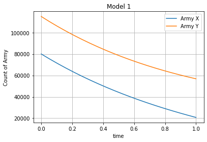
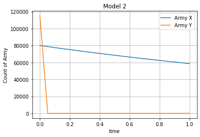

---
# Front matter
lang: ru-RU
title: "Отчет по лабораторной работе №3: Модель боевых действий"
subtitle: "*дисциплина: Математическое моделирование*"
author: "Сасин Ярослав Игоревич, НФИбд-03-18"


# Formatting
toc-title: "Содержание"
toc: true # Table of contents
toc_depth: 2
lof: true # List of figures
lot: true # List of tables
fontsize: 12pt
linestretch: 1.5
papersize: a4paper
documentclass: scrreprt
polyglossia-lang: russian
polyglossia-otherlangs: english
mainfont: PT Serif
romanfont: PT Serif
sansfont: PT Sans
monofont: PT Mono
mainfontoptions: Ligatures=TeX
romanfontoptions: Ligatures=TeX
sansfontoptions: Ligatures=TeX,Scale=MatchLowercase
monofontoptions: Scale=MatchLowercase
indent: true
pdf-engine: lualatex
header-includes:
  - \linepenalty=10 # the penalty added to the badness of each line within a paragraph (no associated penalty node) Increasing the value makes tex try to have fewer lines in the paragraph.
  - \interlinepenalty=0 # value of the penalty (node) added after each line of a paragraph.
  - \hyphenpenalty=50 # the penalty for line breaking at an automatically inserted hyphen
  - \exhyphenpenalty=50 # the penalty for line breaking at an explicit hyphen
  - \binoppenalty=700 # the penalty for breaking a line at a binary operator
  - \relpenalty=500 # the penalty for breaking a line at a relation
  - \clubpenalty=150 # extra penalty for breaking after first line of a paragraph
  - \widowpenalty=150 # extra penalty for breaking before last line of a paragraph
  - \displaywidowpenalty=50 # extra penalty for breaking before last line before a display math
  - \brokenpenalty=100 # extra penalty for page breaking after a hyphenated line
  - \predisplaypenalty=10000 # penalty for breaking before a display
  - \postdisplaypenalty=0 # penalty for breaking after a display
  - \floatingpenalty = 20000 # penalty for splitting an insertion (can only be split footnote in standard LaTeX)
  - \raggedbottom # or \flushbottom
  - \usepackage{float} # keep figures where there are in the text
  - \floatplacement{figure}{H} # keep figures where there are in the text
---

# Введение 

## Цель работы

Основной целью лабораторной работы можно считать ознакомление с простейшими моделями боевых действий - моделями Ланчестера. 

## Задачи работы

Можно выделить следующие задачи третьей лабораторной работы:  
1. изучение моделей Ланчестера для трех случаев ведения боевых действий;  
2. написать код, при помощи которого можно построить графики изменения численности войск армий для случаев, указанных в моем варианте лабораторной работы. 

## Объект и предмет исследования

Объектом исследования третьей лабораторной работы можно считать модели Ланчестера. Предметами же исследования можно считать случаи, которые рассматриваются в моем варианте лабораторной работе. 

# Модель боевых действий

В общем случае главной характеристикой соперников в модели боевых действий являются численности сторон. Если в какой-то момент времени одна из численностей обращается в нуль, то данная сторона считается проигравшей (при условии, что численность другой стороны в данный момент положительна).

## Боевые действия между регулярными войсками. 

Численность регулярных войск определяется следующими факторами:
- скорость уменьшения численности войск из-за причин, не связанных с боевыми действиями (болезни, травмы, дезертирство);  
- скорость потерь, обусловленных боевыми действиями противоборствующих сторон (что связанно с качеством стратегии, уровнем вооружения, профессионализмом солдат и т.п.);  
- скорость поступления подкрепления (задаётся некоторой функцией от времени).

Модель боевых действий описывается следующим образом: 

$$ 
\begin{cases}
  \frac{dx}{dt} = -a(t)x(t) - b(t)y(t)+P(t)
\\
  \frac{dx}{dt} = -c(t)x(t) - h(t)y(t)+Q(t)
\end{cases}
$$

где

$a(t), h(t)$ - величины, характеризующие степень влияния различных факторов на потери, не связаннын с боевыми действиями, 

$b(t), c(t)$ - коэффиценты, указывающие на эффективность боевых действий со стороны $y$ и $x$ соответственно,

$P(t),Q(t)$ - функции, учитывающие
возможность подхода подкрепления к войскам Х и У в течение одного дня.

Данные обозначения будут использованы в ходе описания лабораторной работы.

## Боевые действия с участием регулярных войск и партизанских отрядов

Модель усложняется, в борьбу добавляются партизанские отряды. Темп потерь партизан, проводящих свои операции в разных местах на некоторой известной территории, пропорционален не только численности армейских соединений, но и численности самих партизан:

$$ 
\begin{cases}
  \frac{dx}{dt} = -a(t)x(t) - b(t)y(t)+P(t)
\\
  \frac{dx}{dt} = -c(t)x(t)y(t) - h(t)y(t)+Q(t)
\end{cases}
$$

## Боевые действия между партизанскими отрядами

$$ 
\begin{cases}
  \frac{dx}{dt} =  -a(t)x(t) - b(t)x(t)y(t)+P(t)
\\
  \frac{dx}{dt} =  -c(t)x(t)y(t) - h(t)y(t)+Q(t)
\end{cases}
$$

## Модель боевых действий между регулярными войсками с постоянными коэффициентами

**Особенности модели:**
- коэффициенты $b(t), c(t)$ постоянны;
- потери, не связанные с боевыми действиями, не учитываются;
- не учитывается возможность подхода подкрепления;
- $x$, $y$ - численность противостоящих армий.

$$ 
\begin{cases}
  \dot{x} = - by
\\
  \dot{y} = -cx
\end{cases}
$$

Точное решение:

$$
\frac{dx}{dy} = \frac{by}{cx}
$$

$cxdx = bydy$, $cx^2-by^2 = C$

При:   
- $C < 0$ - армия $y$ выигрывает;  
- $C > 0$ - армия $x$ выигрывает;  
- $C = 0$ - истребление обеих армий (требуется бесконечно большое время).

**Вывод модели:** для борьбы с вдвое большей армией нужно в 4 раза более мощьное оружие, с втрое более многочисленным - в девять раз и т.д..

## Модель боевых действий с участием регулярных войск и партизанских отрядов с постоянными коэффициентами

Модель принимает вид:

$$
\begin{cases}
  \frac{dx}{dt} = - b(t)y(t)
\\
  \frac{dx}{dt} = -c(t)x(t)y(t)
\end{cases},
$$

где 

$\frac{dx}{dt}$ -  темп изменения численности рнегулярных войск,

$\frac{dy}{dt}$ - темп изменения численности партизанских войск.

При заданных начальных условиях уравнение $\frac{d}{dt}\bigg(\frac{b}{2}x^2(t) - cy(t)\bigg) = 0$ имеет единственное решение:

$$
\frac{b}{2}x^2(t) - cy(t) = \frac{b}{2}x^2(0) - cy(0) = C_1
$$

При:    
- $C_1 < 0$ - партизаны побеждают;  
- $C_1 > 0$ - регулярная армия выигрывает;  
- $C_1 = 0$ - истребление обоих войск (требуется бесконечно большое время).

Чтобы партизаны одержали победу, необходимо увеличить коэффицент $c$ и повысить начальную численность. Это увеличение должно расти пропорционально второй степени $x(0)$ (начальная численность регулярных войск).

**Вывод:** регулярные войска находятся в более выгодном положении, так как неравенство для них выполняется при меньшем росте начальной численности войск.

# Выполнение лабораторной работы

## Формулировка задачи из варианта


**Вариант 26**

Между страной $X$ и страной $Y$ идет война. Численности состава войск исчисляются от начала войны, и являются временными функциями $x(t)$ и $y(t)$. В начальный момент времени страна $X$ имеет армию численностью $80 000$ человек, а в распоряжении страны $Y$ армия численностью $115 000$ человек. Для упрощения модели считаем, что коэфициенты $a, b, c, h$ постоянны. Также считаем $P(t)$ и $Q(t)$ непрерывными функциями. 

Постройте графики изменения численности войск армии $$ и армии $$ для следующих случаев:

1. Модель боевых действий между регулярными войсками

$$ 
\frac{dx}{dt} = -0.3x(t) - 0.56y(t) + sin(t+10) 
$$

$$ 
\frac{dy}{dt} = -0.68x(t) - 0.33y(t) + cos(t + 10)
$$

2. Модель ведение боевых действий с участием регулярных войск и партизанских отрядов

$$ 
\frac{dx}{dt} = -0.31x(t) - 0.77y(t) + sin(2t + 10) 
$$

$$ 
\frac{dy}{dt} = -0.67x(t)y(t) - 0.51y(t) + cos(t + 10)
$$

## Реализация алгоритмов

### Реализация модели боевых действий между регулярными войсками

$$ 
\frac{dx}{dt} = -0.3x(t) - 0.56y(t) + sin(t + 10) 
$$

$$ 
\frac{dy}{dt} = -0.68x(t) - 0.33y(t) + cos(t + 10)
$$

Инициализация библиотек:

```py
	import numpy as np
	from math import sin, cos
	from scipy.integrate import odeint
	import matplotlib.pyplot as plt
```

Начальные значения:

```py
x0 = 80000 # численность первой армии
y0 = 115000 # численность второй армии

v0 = np.array([x0, y0]) # вектор начальных условий
```


Константы:

```py
a = 0.3 # степень влияния различных факторов на потери армии X
b = 0.56 # эффективность боевых действий армии Y
c = 0.68 # эффективность боевых действий армии X
h = 0.33 # степень влияния различных факторов на потери армии Y
```

Функции подсчета возможности подхода подкрепления к армиям:

```py
def P(t): # возможность подхода подкрепления к армии X
    p = sin(t + 10)
    return p

def Q(t): # возможность подхода подкрепления к армии Y
    q = cos(t + 10)
    return q
```

Функция системы дифференциальных уравнений:

```py
	def syst(y, t): # система дифференциальных уравнений
		# изменение численности армии X
	    dy1 = - a*y[0] - b*y[1] + P(t)
	    # изменение численности армии Y 
	    dy2 = - c*y[0] - h*y[1] + Q(t)
	    return [dy1, dy2]
```

Решение системы ОДУ:

```py
t = np.linspace(0,1,20)
y = odeint(syst, v0, t) # решение системы

xpoint = [elem[0] for elem in y] # решение ОДУ для армии X
ypoint = [elem[1] for elem in y] # решение ОДУ для армии Y
```

Построение графиков:

```py
	plt.title("Model 1") # добавление названия графика
	# построение графика изменения численности армии X
	plt.plot(t, xpoint, label = 'Army X') 
	# построение графика изменения численности армии Y
	plt.plot(t, ypoint, label = 'Army Y') 

	plt.xlabel('time') # добавление названия оси абцисс
	plt.ylabel('Count of Army') # добавление названия оси ординат
	plt.legend() # добавление легенды графика
	plt.grid() # добавление координатной сетки
	plt.show() # отображение графика
```

После выполнения программы выведется следующий график (рис. -@fig:001):

{ #fig:001 width=70% }

### Реализация модели ведения боевых действий с участием регулярных войск и партизанских отрядов

$$ 
\frac{dx}{dt} = -0.31x(t) - 0.77y(t) + sin(2t + 10) 
$$

$$ 
\frac{dy}{dt} = -0.67x(t)y(t) - 0.51y(t) + cos(t + 10)
$$

Инициализация библиотек:

```py
	import numpy as np
	from math import sin, cos
	from scipy.integrate import odeint
	import matplotlib.pyplot as plt
```

Начальные значения:

```py
x0 = 80000 # численность первой армии
y0 = 115000 # численность второй армии

v0 = np.array([x0, y0]) # вектор начальных условий
```

Константы:

```py
a = 0.31 # степень влияния различных факторов на потери армии X
b = 0.77 # эффективность боевых действий армии Y
c = 0.67 # эффективность боевых действий армии X
h = 0.51 # степень влияния различных факторов на потери армии Y
```

Функции подсчета возможности подхода подкрепления к армиям:

```py
def P(t): # возможность подхода подкрепления к армии X
    p = sin(2*t + 10)
    return p

def Q(t): # возможность подхода подкрепления к армии Y
    q = cos(t + 10)
    return q
```

Функция системы дифференциальных уравнений:

```py
def syst(y, t): # система дифференциальных уравнений
    # изменение численности армии X
    dy1 = - a*y[0] - b*y[1] + P(t)
    # изменение численности армии Y 
    dy2 = - c*y[0]*y[1] - h*y[1] + Q(t)
    return [dy1, dy2]
```

Решение системы ОДУ:

```py
y = odeint(syst, v0, t) # решение систесы

xpoint = [elem[0] for elem in y] # решение ОДУ для армии X
ypoint = [elem[1] for elem in y] # решение ОДУ для армии Y
```

Построение графиков:

```py
	plt.title("Model 2") # добавление названия графика
	# построение графика изменения численности армии X
	plt.plot(t, xpoint, label = 'Army X') 
	# построение графика изменения численности армии Y
	plt.plot(t, ypoint, label = 'Army Y') 

	plt.xlabel('time') # добавление названия оси абцисс
	plt.ylabel('Count of Army') # добавление названия оси ординат
	plt.legend() # добавление легенды графика
	plt.grid() # добавление координатной сетки
	plt.show() # отображение графика
```

После выполнения программы выведется следующий график (рис. -@fig:002):

{ #fig:002 width=70% }

# Выводы

В ходе выполнения лабораторной работы было проведено ознакомление с простейшими моделями боевых действий. 

По построенным графикам моделей можно сделать вывод, что при участии партизанских отрядов, армия Y с большой вероятностью выйграет битву, в то время как армия X потерпит сокрушительное поражение. Если же партизанскии отряды не будут принимать участие в битве, то армия Y с большей вероятностью потерпит поражение, нежели чем армия X. 

