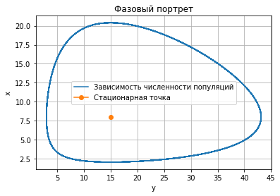
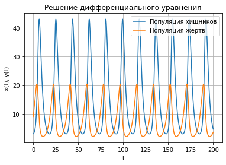

---
## Front matter
lang: ru-RU
title: "Отчет по лабораторной работе №5: Модель хищник - жертва"
subtitle: "*дисциплина: Математическое моделирование*"
author: "Сасин Ярослав Игоревич, НФИбд-03-18"

## Formatting
toc: false
slide_level: 2
theme: metropolis
header-includes:
 - \metroset{progressbar=frametitle,sectionpage=progressbar,numbering=fraction}
 - '\makeatletter'
 - '\beamer@ignorenonframefalse'
 - '\makeatother'
aspectratio: 43
section-titles: true

---

# Введение 

**Целью лабораторной работы** можно считать построение математической модели хищник - жертва. 

**Задачи лабораторной работы:**  
1. изучение модели хищник - жертва;    
2. написать код, при помощи которого можно построить графики фазового портрета для случаев, указанных в моем варианте лабораторной работы. 

**Объектом исследования** в данной лабораторной работе является модель хищник - жертва, а **предметом исследования** - случай, представленный в моем варианте лабораторной работы.

# Модель хищник - жертва

В общем виде математическую модель можно записать так: 

$$
  \begin{cases}
    \frac{dx}{dt} =  ax(t) - bx(t)y(t)
    \\
    \frac{dx}{dt} =  -cy(t) + dx(t)y(t)
  \end{cases},
$$

где: 

- $x$ - число жертв;  
- $y$ - число хищников;  
- $a$ -  коэффициент, описывающий скорость естественного прироста числа жертв в отсутствие хищников;  
- $c$ - естественное вымирание хищников, лишенных пищи в виде жертв.  

## Стационарное состояние

Стационарное состояние системы (положение равновесия, не зависящее от времени решение) будет в точке: 

$$
x_0 = \frac{c}{d}, y_0 = \frac{a}{d}
$$ 

# Формулировка задачи 

**Вариант 26**

Для модели «хищник-жертва»:

$$
  \begin{cases}
    \frac{dx}{dt} =  - 0.44x(t) + 0.055x(t)y(t)
    \\
    \frac{dx}{dt} = 0.33y(t) - 0.022x(t)y(t)
  \end{cases}
$$

Постройте график зависимости численности хищников от численности жертв, а также графики изменения численности хищников и численности жертв при следующих начальных условиях: $x_0 = 3, y_0 = 9$. Найдите стационарное состояние системы.

## Подключение библиотек

```py
	import numpy as np
	from math import sin, cos, sqrt
	from scipy.integrate import odeint
	import matplotlib.pyplot as plt
```

## Функция, описывающая дифференциальные уравнения

```py 
def dx(x, t):
    dx1 = - a * x[0] + b * x[0] * x[1]
    dx2 = c * x[1] - d * x[0] * x[1] 
    return [dx1, dx2]
```

## Построение фазового портрета и стационарной точки

```py
 	def draw_plot(x, y, xs, ys):
    	plt.plot(x, y, label = 'Зависимость численности популяций')
    	plt.plot(xs, ys, marker='o', label = 'Стационарная точка')
    	plt.title("Фазовый портрет")
    	plt.xlabel('y')
    	plt.ylabel('x')
    	plt.legend()
    	plt.grid()
    	plt.show()
```

## Построения графика решений

```py
	def draw_plot(x, y, t):
    	plt.plot(t, x, label = 'Популяция хищников')
    	plt.plot(t, y, label = 'Популяция жертв')
    	plt.title("Решение дифференциального уравнения")
    	plt.xlabel('t')
    	plt.ylabel('x(t), y(t)')
    	plt.legend()
    	plt.grid()
    	plt.show()
```

## Начальные значения

```py 
a = 0.44; # коэффициент естественной смертности хищников
b = 0.055; # коэффициент естественного прироста жертв
c = 0.33; # коэффициент увеличения числа хищников
d = 0.022; # коэффициент смертности жертв

  # Интервал, в котором решается задача
t = np.linspace(0, 200, 8000)

  # Начальные условия x и y
  # (популяция хищников и популяция жертв)
v0 = np.array([3, 9])
```

## Решение диффееренциального уравнения и построение графика

```py
  	# Решаем дифференциальные уравнения
  	x = odeint(dx, v0, t)

  	# Переписываем отдельно 
  	# y в xpoint, x в ypoint
  	xpoint = [elem[0] for elem in x] 
  	ypoint = [elem[1] for elem in x]

  	# Нахождение стационарной точки системы
  	xs = c/d
  	ys = a/b
```

## Решение диффееренциального уравнения и построение графиков

```py
  # Построим фазовый портрет 
  draw_fplot(xpoint, ypoint, xs, ys)

  # Построим график решений
  draw_plot(xpoint, ypoint, t)
```

# Построенные графики

{ #fig:001 width=70% }

## Построенные графики

{ #fig:002 width=70% }

# Выводы

В ходе выполнения лабораторной работы было проведено ознакомление с моделью хищник - жертва, а также построены фазовый портрет, стационарная точка и график решений для заданных параметров модели. 
