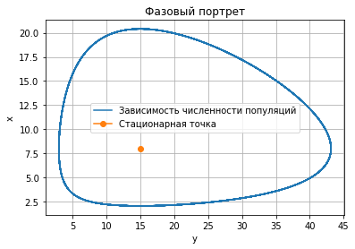
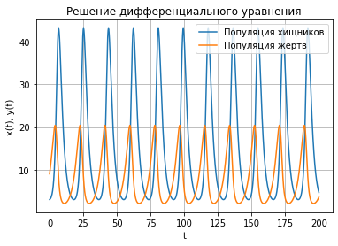

---
# Front matter
lang: ru-RU
title: "Отчет по лабораторной работе №5: Модель хищник - жертва"
subtitle: "*дисциплина: Математическое моделирование*"
author: "Сасин Ярослав Игоревич, НФИбд-03-18"


# Formatting
toc-title: "Содержание"
toc: true # Table of contents
toc_depth: 2
lof: true # List of figures
fontsize: 12pt
linestretch: 1.5
papersize: a4paper
documentclass: scrreprt
polyglossia-lang: russian
polyglossia-otherlangs: english
mainfont: PT Serif
romanfont: PT Serif
sansfont: PT Sans
monofont: PT Mono
mainfontoptions: Ligatures=TeX
romanfontoptions: Ligatures=TeX
sansfontoptions: Ligatures=TeX,Scale=MatchLowercase
monofontoptions: Scale=MatchLowercase
indent: true
pdf-engine: lualatex
header-includes:
  - \linepenalty=10 # the penalty added to the badness of each line within a paragraph (no associated penalty node) Increasing the value makes tex try to have fewer lines in the paragraph.
  - \interlinepenalty=0 # value of the penalty (node) added after each line of a paragraph.
  - \hyphenpenalty=50 # the penalty for line breaking at an automatically inserted hyphen
  - \exhyphenpenalty=50 # the penalty for line breaking at an explicit hyphen
  - \binoppenalty=700 # the penalty for breaking a line at a binary operator
  - \relpenalty=500 # the penalty for breaking a line at a relation
  - \clubpenalty=150 # extra penalty for breaking after first line of a paragraph
  - \widowpenalty=150 # extra penalty for breaking before last line of a paragraph
  - \displaywidowpenalty=50 # extra penalty for breaking before last line before a display math
  - \brokenpenalty=100 # extra penalty for page breaking after a hyphenated line
  - \predisplaypenalty=10000 # penalty for breaking before a display
  - \postdisplaypenalty=0 # penalty for breaking after a display
  - \floatingpenalty = 20000 # penalty for splitting an insertion (can only be split footnote in standard LaTeX)
  - \raggedbottom # or \flushbottom
  - \usepackage{float} # keep figures where there are in the text
  - \floatplacement{figure}{H} # keep figures where there are in the text
---

# Введение

## Цель работы

Основной целью лабораторной работы можно считать построение математической модели хищник - жертва.

## Задачи работы

Можно выделить следующие задачи пятой лабораторной работы:  
1. изучение модели хищник - жертва;  
2. написать код, при помощи которого можно построить графики фазового портрета для случаев, указанных в моем варианте лабораторной работы. 

## Объект и предмет исследования

Объектом исследования в данной лабораторной работе является модель хищник - жертва, а предметом исследования - случай, представленный в моем варианте лабораторной работы.

# Модель хищник - жертва

Простейшая модель взаимодействия двух видов типа «хищник — жертва» - *модель Лотки-Вольтерры*. Данная двувидовая модель основывается на следующих предположениях:

1. Численность популяции жертв $x$ и хищников $y$ зависят только от времени;

2. В отсутствии взаимодействия численность видов изменяется по модели Мальтуса, при этом число жертв увеличивается, а число хищников падает;

3. Естественная смертность жертвы и естественная рождаемость хищника несущественны;

4. Эффект насыщения численности обеих популяций не учитывается;

5. Скорость роста численности жертв уменьшается пропорционально численности хищников.

В общем виде математическую модель можно записать так: 

$$
  \begin{cases}
    \frac{dx}{dt} =  ax(t) - bx(t)y(t)
    \\
    \frac{dx}{dt} =  -cy(t) + dx(t)y(t)
  \end{cases},
$$

где: 

- $x$ - число жертв;

- $y$ - число хищников;

- $a$ -  коэффициент, описывающий скорость естественного прироста числа жертв в отсутствие хищников;

- $c$ - естественное вымирание хищников, лишенных пищи в виде жертв.

Вероятность взаимодействия жертвы и хищника считается пропорциональной как количеству жертв, так и числу самих хищников ($xy$). Каждый акт взаимодействия уменьшает популяцию жертв, но способствует увеличению популяции хищников (члены $-bxy$ и $dxy$ в правой части уравнения).

## Стационарное состояние

Стационарное состояние системы (положение равновесия, не зависящее от времени решение) будет в точке: $x_0 = \frac{c}{d}, y_0 = \frac{a}{d}$. Если начальные значения задать в стационарном состоянии $x(0) = x_0, y(0)=y_0$, то в любой момент времени численность популяций изменяться не будет. При малом  от положения равновесия численности как хищника, так и жертвы с течением времени не возвращаются к равновесным значениям, а совершают периодические колебания вокруг стационарной точки. Амплитуда колебаний и их период определяется начальными значениями численностей $x(0), y(0)$. Колебания совершаются в противофазе.

## Малое изменение модели

При малом изменении модели

$$
\begin{cases}
\frac{dx}{dt} =  ax(t) - bx(t)y(t) + \varepsilon f(x,y)
\\
\frac{dx}{dt} = -cy(t) + dx(t)y(t) + \varepsilon g(x,y), \varepsilon \ll 1
\end{cases}
$$

прибавленые к правым частям малые члены, учитывают конкуренцию жертв за пищу и хищников за жертв и т.п., а вывод о периодичности, справедливый для жесткой системы Лотки-Вольтерры, теряет силу. Таким образом, мы получаем так называемую мягкую модель «хищник-жертва».

В зависимости от вида малых поправок $f$ и $g$ возможны следующие сценарии:

1. Равновесное состояние устойчиво. При любых других начальных условиях через большое время устанавливается именно оно.

2. Система стационарное состояние неустойчиво. Эволюция приводит то к резкому увеличению числа хищников, то к их почти полному вымиранию.

3. В системе с неустойчивым стационарным состоянием с течением времени устанавливается периодический режим. В отличие от исходной жесткой модели Лотки-Вольтерры, в этой модели установившийся периодический режим не зависит от начального условия. Первоначально незначительное отклонение от стационарного состояния приводит не к малым колебаниям около этого состояния, как в модели Лотки-Вольтерры, а к колебаниям вполне определенной (и не зависящей от малости отклонения)

**Вывод:** жесткую модель всегда надлежит исследовать на структурную устойчивость полученных при ее изучении результатов по отношению к малым изменениям модели (делающим ее мягкой).

# Выполнение лабораторной работы

## Формулировка задачи из варианта


**Вариант 26**

Для модели «хищник-жертва»:

$$
  \begin{cases}
    \frac{dx}{dt} =  - 0.44x(t) + 0.55x(t)y(t)
    \\
    \frac{dx}{dt} = 0.33y(t) - 0.022x(t)y(t)
  \end{cases}
$$

Постройте график зависимости численности хищников от численности жертв, а также графики изменения численности хищников и численности жертв при следующих начальных условиях: $x_0 = 3, y_0 = 9$. Найдите стационарное состояние системы.

## Реализация алгоритмов

Решение лабораторной работы может быть реализовано на многих языках программирования. В моем случае это язык программирования Python. Далее будет представлен код на этом языке программирования.

### Подключение библиотек

Для того, чтобы использовать многие формулы, а также для построения графиков, необходимо подключить определенные библиотеки, в которых эти формулы описаны:

```py
  import numpy as np
  from math import sin, cos, sqrt
  from scipy.integrate import odeint
  import matplotlib.pyplot as plt
```

### Функция, описывающая дифференциальные уравнения

Функция для решение системы дифференциальных уравнений имеет вид: 

```py 
def dx(x, t):
    dx1 = - a * x[0] + b * x[0] * x[1]
    dx2 = c * x[1] - d * x[0] * x[1] 
    return [dx1, dx2]
```

### Построение графика функции 

Для удобства вынесем построение графиков в отдельные функции:

```py
  # Функцкия построения фазового портрета
  def draw_fplot(x, y, xs, ys):
    plt.plot(x, y, label = 'Зависимость численности популяций')
    plt.plot(xs, ys, marker='o', label = 'Стационарная точка')
    plt.title("Фазовый портрет")
    plt.xlabel('y')
    plt.ylabel('x')
    plt.legend()
    plt.grid()
    plt.show()
```

```py
  # Функция построения графика решения
  def draw_plot(x, y, t):
    plt.plot(t, x, label = 'Популяция хищников')
    plt.plot(t, y, label = 'Популяция жертв')
    plt.title("Решение дифференциального уравнения")
    plt.xlabel('t')
    plt.ylabel('x(t), y(t)')
    plt.legend()
    plt.grid()
    plt.show()
```

### Начальные значения

Начальные условия задаются следующим образом:

```py 
a = 0.44; # коэффициент естественной смертности хищников
b = 0.055; # коэффициент естественного прироста жертв
c = 0.33; # коэффициент увеличения числа хищников
d = 0.022; # коэффициент смертности жертв

  # Интервал, в котором решается задача
t = np.linspace(0, 130, 8000)

  # Начальные условия x и y
  # (популяция хищников и популяция жертв)
v0 = np.array([3, 9])
```


### Решение диффееренциального уравнения и построение графиков

```py
  # Решаем дифференциальные уравнения
  x = odeint(dx, v0, t)

  # Переписываем отдельно 
  # y в xpoint, x в ypoint
  xpoint = [elem[0] for elem in x] 
  ypoint = [elem[1] for elem in x]

  # Нахождение стационарной точки системы
  xs = c/d
  ys = a/b

  # Построим фазовый портрет 
  draw_fplot(xpoint, ypoint, xs, ys)

  # Построим график решений
  draw_plot(xpoint, ypoint, t)
```

## Построенные графики

При запуске получившейся программы получаем следующие графики, (рис. -@fig:001, рис. -@fig:002):

{ #fig:001 width=70% }

{ #fig:002 width=70% }

# Выводы

В ходе выполнения лабораторной работы было проведено ознакомление с моделью хищник - жертва, а также построены фазовый портрет, стационарная точка и график решений для заданных параметров модели. 
