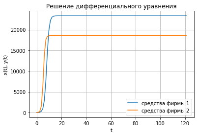
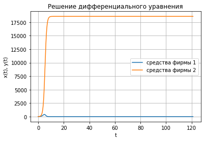

---
# Front matter
lang: ru-RU
title: "Отчет по лабораторной работе №8: Модель конкуренции двух фирм"
subtitle: "*дисциплина: Математическое моделирование*"
author: "Сасин Ярослав Игоревич, НФИбд-03-18"


# Formatting
toc-title: "Содержание"
toc: true # Table of contents
toc_depth: 2
lof: true # List of figures
fontsize: 12pt
linestretch: 1.5
papersize: a4paper
documentclass: s{cr}reprt
polyglossia-lang: russian
polyglossia-otherlangs: english
mainfont: PT Serif
romanfont: PT Serif
sansfont: PT Sans
monofont: PT Mono
mainfontoptions: Ligatures=TeX
romanfontoptions: Ligatures=TeX
sansfontoptions: Ligatures=TeX,Scale=MatchLowercase
monofontoptions: Scale=MatchLowercase
indent: true
pdf-engine: lualatex
header-includes:
  - \linepenalty=10 # the penalty added to the badness of each line within a paragraph (no associated penalty node) In{cr}easing the value makes tex try to have fewer lines in the paragraph.
  - \interlinepenalty=0 # value of the penalty (node) added after each line of a paragraph.
  - \hyphenpenalty=50 # the penalty for line breaking at an automatically inserted hyphen
  - \exhyphenpenalty=50 # the penalty for line breaking at an explicit hyphen
  - \binoppenalty=700 # the penalty for breaking a line at a binary operator
  - \relpenalty=500 # the penalty for breaking a line at a relation
  - \clubpenalty=150 # extra penalty for breaking after first line of a paragraph
  - \widowpenalty=150 # extra penalty for breaking before last line of a paragraph
  - \displaywidowpenalty=50 # extra penalty for breaking before last line before a display math
  - \brokenpenalty=100 # extra penalty for page breaking after a hyphenated line
  - \predisplaypenalty=10000 # penalty for breaking before a display
  - \postdisplaypenalty=0 # penalty for breaking after a display
  - \floatingpenalty = 20000 # penalty for splitting an insertion (can only be split footnote in standard LaTeX)
  - \raggedbottom # or \flushbottom
  - \usepackage{float} # keep figures where there are in the text
  - \floatplacement{figure}{H} # keep figures where there are in the text
---

# Введение
## Цель работы

Основной целью лабораторной работы можно считать построение математической модели двух конкурирующих фирм с идентичным
товаром.

## Задачи работы

Можно выделить следующие задачи пятой лабораторной работы:  
1. изучение модели конкуренции;  
2. написать код, при помощи которого можно построить графики изменения объемов оборотных средств для случаев, указанных в моем варианте лабораторной работы. 

## Объект и предмет исследования

Объектом исследования в данной лабораторной работе является модель конкуренции двух фирм, а предметом исследования - случай, представленный в моем варианте лабораторной работы.

## Модель конкуренции двух фирм.
### Модель одной фирмы
Для построения модели конкуренции хотя бы двух фирм необходимо
рассмотреть модель одной фирмы. Вначале рассмотрим модель фирмы,
производящей продукт долговременного пользования, когда цена его определяется
балансом спроса и предложения. Примем, что этот продукт занимает
определенную нишу рынка и конкуренты в ней отсутствуют.

Обозначим:

$N$ – число потребителей производимого продукта.

$S$ – доходы потребителей данного продукта. Считаем, что доходы всех
потребителей одинаковы. Это предположение справедливо, если речь идет об
одной рыночной нише, т.е. производимый продукт ориентирован на определенный
слой населения.

$M$ – оборотные средства предприятия

$τ$ – длительность производственного цикла

$p$ – рыночная цена товара

$p̃$ – себестоимость продукта, то есть переменные издержки на производство
единицы продукции.

$δ$ – доля оборотных средств, идущая на покрытие переменных издержек.

$κ$ – постоянные издержки, которые не зависят от количества выпускаемой
продукции.

$Q(S/p)$ – функция спроса, зависящая от отношения дохода S к цене p. Она
равна количеству продукта, потребляемого одним потребителем в единицу
времени.
Функцию спроса товаров долговременного использования часто
представляют в простейшей форме:

$$
Q = q - k \frac{p}{S} = q(1 - \frac{p}{p_{cr}})
$$ (1)

где $q$ – максимальная потребность одного человека в продукте в единицу времени.
Эта функция падает с ростом цены и при $p = p_{cr}$ (критическая стоимость продукта)
потребители отказываются от приобретения товара. Величина $p_{cr} = Sq/k$.
Параметр $k$ – мера эластичности функции спроса по цене. Таким образом, функция
спроса в форме (1) является пороговой (то есть, $Q(S/p) = 0$ при $p ≥ p_({cr})$) и обладает
свойствами насыщения.
Уравнения динамики оборотных средств можно записать в виде

$$
\frac{dM}{dt} = -\frac{Mδ}{τ} + NQp - κ = -\frac{Mδ}{τ} + Nq(1 - \frac{p}{p_{cr}})p - κ
$$ (2)

Уравнение для рыночной цены p представим в виде

$$
\frac{dp}{dt} = γ(-\frac{Mδ}{τp̃}+Nq(1 - \frac{p}{p_{cr}}))
$$ (3)

Первый член соответствует количеству поставляемого на рынок товара (то
есть, предложению), а второй член – спросу.
Параметр γ зависит от скорости оборота товаров на рынке. Как правило,
время торгового оборота существенно меньше времени производственного цикла τ.
При заданном M уравнение (3) описывает быстрое стремление цены к
равновесному значению цены, которое устойчиво.
В этом случае уравнение (3) можно заменить алгебраическим соотношением

$$
-\frac{Mδ}{τp̃}+Nq(1 - \frac{p}{p_{cr}}) = 0
$$
(4)

Из (4) следует, что равновесное значение цены p равно

$$
p = p_{cr}(1-\frac{Mδ}{τp̃Nq})
$$
(5)

Уравнение (2) с учетом (5) приобретает вид

$$
\frac{dM}{dt} = M\frac{δ}{τ}(\frac{p_{cr}}{p} - 1) - M^2(\frac{δ}{τp̃})^2\frac{p_{cr}}{Nq} - κ
$$ (6)

Уравнение (6) имеет два стационарных решения, соответствующих
условию $dM/dt = 0$:

$$
M_{1,2} = \frac{1}{2}a ± \sqrt{\frac{a^2}{4} - b}
$$ (7)

где

$$
a = Nq(1 - \frac{p̃}{p_{cr}})p̃\frac{τ}{δ}, b = кNq\frac{(τp̃)^2}{p_{cr}δ^2}
$$(8)

Из (7) следует, что при больших постоянных издержках (в случае $a^2 < 4b$)
стационарных состояний нет. Это означает, что в этих условиях фирма не может
функционировать стабильно, то есть, терпит банкротство. Однако, как правило,
постоянные затраты малы по сравнению с переменными (то есть, $b << a^2$) и играют
роль, только в случае, когда оборотные средства малы. При $b << a$ стационарные
значения M равны

$$
M_+ = Nq\frac{τ}{δ}(1 - \frac{p̃}{p_{cr}})p̃, M_- = кp̃\frac{τ}{δ(p_{cr} - p̃)}
$$
(9)

Первое состояние $M_+$ устойчиво и соответствует стабильному
функционированию предприятия. Второе состояние $M_-$ неустойчиво, так, что
при $M < M_-$ оборотные средства падают ($dM/dt < 0$), то есть, фирма идет к 
банкротству. По смыслу $M_-$ соответствует начальному капиталу, необходимому
для входа в рынок.
В обсуждаемой модели параметр $δ$ всюду входит в сочетании с $τ$. Это значит,
что уменьшение доли оборотных средств, вкладываемых в производство,
эквивалентно удлинению производственного цикла. Поэтому мы в дальнейшем
положим: $δ = 1$, а параметр $τ$ будем считать временем цикла, с учётом сказанного.

### Конкуренция двух фирм
#### Случай 1
Рассмотрим две фирмы, производящие взаимозаменяемые товары
одинакового качества и находящиеся в одной рыночной нише. Последнее означает,
что у потребителей в этой нише нет априорных предпочтений, и они приобретут
тот или иной товар, не обращая внимания на знак фирмы.
В этом случае, на рынке устанавливается единая цена, которая определяется
балансом суммарного предложения и спроса. Иными словами, в рамках нашей
модели конкурентная борьба ведётся только рыночными методами. То есть,
конкуренты могут влиять на противника путем изменения параметров своего
производства: себестоимость, время цикла, но не могут прямо вмешиваться в
ситуацию на рынке («назначать» цену или влиять на потребителей какимлибо иным способом.)
Уравнения динамики оборотных средств запишем по аналогии с (2) в виде

$$
\frac{dM_1}{dt}= -\frac{M_1δ}{τ_1} + N_1q(1 - \frac{p}{p_{cr}})p - κ_1
$$
$$
\frac{dM_2}{dt}= -\frac{M_2δ}{τ_2} + N_2q(1 - \frac{p}{p_{cr}})p - κ_2
$$

(10)

где использованы те же обозначения, а индексы 1 и 2 относятся к первой и второй
фирме, соответственно. Величины N1 и N2 – числа потребителей, приобретших
товар первой и второй фирмы.
Учтем, что товарный баланс устанавливается быстро, то есть,
произведенный каждой фирмой товар не накапливается, а реализуется по цене p.
Тогда
$$
\frac{M_1}{τ_1p̃_1} = N_1q(1 - \frac{p}{p_{cr}})
$$
$$
\frac{M_2}{τ_2p̃_2} = N_2q(1 - \frac{p}{p_{cr}})
$$
(11)

где p̃1 и p̃2 – себестоимости товаров в первой и второй фирме.
С учетом (10) представим (11) в виде
$$
\frac{dM_1}{dt}= -\frac{M_1δ}{τ_1}(1 - \frac{p}{p̃_1})-к_1
$$
$$
\frac{dM_2}{dt}= -\frac{M_2δ}{τ_2}(1 - \frac{p}{p̃_2})-к_2
$$

(12)

Уравнение для цены, по аналогии с (3),
$$
\frac{dp}{dt} = -γ(\frac{M_1}{τ_1p̃_1}+\frac{M_2}{τ_2p̃_2}-Nq(1 - \frac{p}{p_{cr}}))
$$
(13)

Считая, как и выше, что ценовое равновесие устанавливается быстро,
получим:
$$
p = p_{cr}(1 - \frac{1}{Nq}(\frac{M_1}{τ_1p̃_1}+\frac{M_2}{τ_2p̃_2}))
$$
(14)

Подставив (14) в (12) имеем:

$$
\frac{dM_1}{dt}= c_1M_1 -bM_1M_2 - a_1M_1^2 - к_1
$$
$$
\frac{dM_2}{dt}= c_2M_2 -bM_1M_2 - a_2M_2^2 - к_2
$$
(15)

где
$$
a_1 = \frac{p_{cr}}{τ_1^2p̃_1^2Nq}, a_2 = \frac{p_{cr}}{τ_2^2p̃_2^2Nq}, b = \frac{p_cr}{τ_2^2p̃_2^2τ_2^2p̃_2^2Nq}, c_1 = \frac{p_{cr} - p̃_1}{τ_1p̃_1}, c_2 = \frac{p_{cr} - p̃_2}{τ_2p̃_2}
$$
(16)

Исследуем систему (15) в случае, когда постоянные издержки (κ1, κ2)
пренебрежимо малы. И введем нормировку $t = c_1\theta$. Получим следующую систему:

$$
\frac{dM_1}{d\theta}= M_1 -\frac{b}{c_1}M_1M_2 - \frac{a_1}{c_1}M_1^2
$$
$$
\frac{dM_2}{d\theta}= M_2 -\frac{b}{c_1}M_1M_2 - \frac{a_2}{c_1}M_2^2
$$
(17)

Чтобы решить систему (17) необходимо знать начальные условия. 
Замечание: Необходимо учесть, что значения$p_{ct}, p̃_2,N$ указаны в тысячах
единиц, а
значения
$M_{1,2}$ указаны в млн. единиц.


# Выполнение лабораторной работы

## Формулировка задачи из варианта


**Вариант 26**

**Случай 1.** Рассмотрим две фирмы, производящие взаимозаменяемые товары
одинакового качества и находящиеся в одной рыночной нише. Считаем, что в рамках
нашей модели конкурентная борьба ведётся только рыночными методами. То есть,
конкуренты могут влиять на противника путем изменения параметров своего 
производства: себестоимость, время цикла, но не могут прямо вмешиваться в
ситуацию на рынке («назначать» цену или влиять на потребителей каким-либо иным
способом.) Будем считать, что постоянные издержки пренебрежимо малы, и в
модели учитывать не будем. В этом случае динамика изменения объемов продаж
фирмы 1 и фирмы 2 описывается следующей системой уравнений:

$$
\frac{dM_1}{d\theta}= M_1 -\frac{b}{c_1}M_1M_2 - \frac{a_1}{c_1}M_1^2
$$
$$
\frac{dM_2}{d\theta}= M_2 -\frac{b}{c_1}M_1M_2 - \frac{a_2}{c_1}M_2^2
$$

где
$$
a_1 = \frac{p_{cr}}{τ_1^2p̃_1^2Nq}, a_2 = \frac{p_{cr}}{τ_2^2p̃_2^2Nq}, b = \frac{p_cr}{τ_2^2p̃_2^2τ_2^2p̃_2^2Nq}, c_1 = \frac{p_{cr} - p̃_1}{τ_1p̃_1}, c_2 = \frac{p_{cr} - p̃_2}{τ_2p̃_2}
$$

**Случай 2.** Рассмотрим модель, когда, помимо экономического фактора
влияния (изменение себестоимости, производственного цикла, использование
кредита и т.п.), используются еще и социально-психологические факторы –
формирование общественного предпочтения одного товара другому, не зависимо от
их качества и цены. В этом случае взаимодействие двух фирм будет зависеть друг
от друга, соответственно коэффициент перед
$M_1M_2$
будет отличаться. Пусть в
рамках рассматриваемой модели динамика изменения объемов продаж фирмы 1 и
фирмы 2 описывается следующей системой уравнений:
$$
\frac{dM_1}{d\theta}= M_1 -(\frac{b}{c_1} + 0.00016)M_1M_2 - \frac{a_1}{c_1}M_1^2
$$
$$
\frac{dM_2}{d\theta}= M_2 -\frac{b}{c_1}M_1M_2 - \frac{a_2}{c_1}M_2^2
$$

Для обоих случаев рассмотрим задачу со следующими начальными условиями и
параметрами:

$M_0^1 = 7.5$, $M_0^2 = 8.5$,

$p_{cr} = 40$, $N = 95$, $q = 1$,

$τ_1 = 30$, $τ_2 = 27$,

$p̃_1 = 11.5$, $p̃_1 = 11.5$

1. Постройте графики изменения оборотных средств фирмы 1 и фирмы 2 без
учета постоянных издержек и с веденной нормировкой для случая 1.
2. Постройте графики изменения оборотных средств фирмы 1 и фирмы 2 без
учета постоянных издержек и с веденной нормировкой для случая 2.


## Реализация алгоритмов

Решение лабораторной работы может быть реализовано на многих языках программирования. В моем случае это язык программирования Python. Далее будет представлен код на этом языке программирования.

### Подключение библиотек

Для того, чтобы использовать многие формулы, а также для построения графиков, необходимо подключить определенные библиотеки, в которых эти формулы описаны:

```py
  import numpy as np
  from scipy.integrate import odeint
  import matplotlib.pyplot as plt
```

### Функция, описывающая дифференциальные уравнения

Функция для решение системы дифференциальных уравнений имеет вид: 

```py 

#Для первого случая:

def dx(x, t):
    dx1 = x[0] - ((b/c1) * x[0] * x[1]) - ((a1/c1) * x[0]**2)
    dx2 = ((c2/c1)*x[1]) - ((b/c1) * x[0] * x[1]) - ((a2/c1) * x[1]**2)
    return[dx1, dx2]
    
#Для второго случая:   

def dx(x, t):
    dx1 = x[0] - ((b/c1 + 0.00016) * x[0] * x[1]) - ((a1/c1) * x[0]**2)
    dx2 = ((c2/c1)*x[1]) - ((b/c1) * x[0] * x[1]) - ((a2/c1) * x[1]**2)
    return[dx1, dx2]
    
```

### Вычисление коэффициентов

Вынесем вычисление коэффициентов в одельные функции:

```py
def a(tau,p):
    a = pcr/(tau**2 * p**2 * N * q)
    return a

b = pcr/(tau1**2 * tau2**2 * p2**2 * p1**2 * N * q)


def c(tau,p):
    c = (pcr - p)/(tau * p)
    return c
```

### Построение графика функции 

Для удобства вынесем построение графиков в отдельную функцию:


```py
def draw_plot(x, y, t):
    plt.plot(t, x, label = 'средства фирмы 1')
    plt.plot(t, y, label = 'средства фирмы 2')
    plt.title("Решение дифференциального уравнения")
    plt.xlabel('t')
    plt.ylabel('x(t), y(t)')
    plt.legend()
    plt.grid()
    plt.show()
```

### Начальные значения

Начальные условия задаются следующим образом:

```py 
v0 = np.array([7.5,8.5])
pcr = 40
N = 95
q = 1
tau1 = 30
tau2 = 27
p1 = 11.5
p2 = 9.5

t = np.linspace(0,10,100)

a1 = a(tau1,p1)
a2 = a(tau2,p2)
b = pcr/(tau1**2 * tau2**2 * p2**2 * p1**2 * N * q)
c1 = c(tau1,p1)
c2 = c(tau2,p2)
theta = t/c1
```


### Решение диффееренциального уравнения и построение графиков

```py
x = odeint(dx, v0, theta)


xpoint = [elem[0] for elem in x] 
ypoint = [elem[1] for elem in x]

draw_plot(xpoint,ypoint,theta)
```

## Построенные графики

При запуске получившейся программы получаем следующие графики, (рис. -@fig:001, рис. -@fig:002):

{ #fig:001 width=70% }

{ #fig:002 width=70% }

# Выводы

В ходе выполнения лабораторной работы было проведено ознакомление с моделью конкуренции двух фирм, а также построены графики решений для заданных параметров модели. 